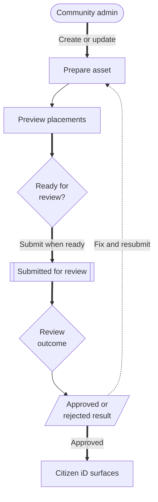

# Branding Assets

Community branding assets let admins manage how a community appears in Citizen iD surfaces.
This area belongs in the community admin guide because it is an operational community workflow, not an OAuth implementation detail.

Branding is visible to members, partner communities, and support staff.
Treat it as public presentation, not just file upload.

**Diagram: Branding asset lifecycle.**
Admins prepare assets, preview placements, submit for review, and then approved assets can represent the community across supported Citizen iD surfaces.

**what should be on the screenshot/diagram:** A branding workflow showing upload or edit, preview matrix, Pending, Submitted, Approved, Rejected, rejection reason, and supported placements.

Read the diagram as a review workflow.
Draft and preview are community-controlled.
Approval decides whether the asset should be used broadly.
A rejected asset should come with enough reason that the next version can fix the real issue.

## Asset Lifecycle

Admins can add assets, preview placements, update pending assets, delete assets, and submit assets for review.
Asset states can appear as Pending, Submitted, Approved, or Rejected.

Approved assets are used across supported Citizen iD surfaces to represent the community.
Unapproved assets may be visible in preview or review contexts, but they should not be treated as public approved branding.

Supported asset types can include graphics such as icons, logos, banners, backgrounds, and theme configuration assets.
The exact placements available to your community depend on the current Citizen iD surface and asset type.

Use the preview matrix before submission so assets work in the placements where Citizen iD will render them.

**what should be on the screenshot/diagram:** A current branding page screenshot showing asset upload, the placement preview matrix, status chips, and a rejected asset with review reason.

## Good Practice

Use clear source files.
Avoid tiny text that will not survive small placements.
Keep variants readable on both light and dark surfaces.
Record why an asset was rejected so the next submission can fix the real issue.

Before submitting, check:

- The asset still reads at small sizes.
- The asset has enough contrast on light and dark backgrounds.
- The asset does not rely on text that becomes unreadable in icon placements.
- The asset does not imply an official Citizen iD partnership unless that status is actually granted.
- The asset does not imply endorsement by Cloud Imperium Games, RSI, or Star Citizen.
- The asset is appropriate for public community-facing use.

## Citizen iD Brand Boundary

Community branding is different from Citizen iD brand usage.
Your community assets represent your community.
Citizen iD assets, names, and status language must follow the shared [Brand Guidelines](/reference/brand-guidelines).

Do not use wording such as "official Citizen iD partner" or "Citizen iD verified" unless that status has actually been granted and is reflected in Citizen iD systems.
Using Citizen iD infrastructure does not mean Citizen iD endorses, certifies, audits, sponsors, operates, or is responsible for the community.

::: warning Public trust
Branding can make a community look more official than intended.
Avoid visual or written presentation that could confuse members about who operates the community, who approved the asset, or what Citizen iD is responsible for.
:::

## Review Feedback

If an asset is rejected, read the reason before replacing the file.
Common issues include low contrast, unreadable text, misleading status language, wrong environment branding, unsuitable aspect ratio, or a file that does not work in the intended placement.

For branding support, include:

- The community slug.
- The asset name or type.
- The current asset status.
- The rejected reason, if available.
- The placement where the asset looked wrong.
- A safe cropped screenshot of the preview, if useful.

Do not send private design source files in public support channels if they contain unrelated or unreleased community material.
