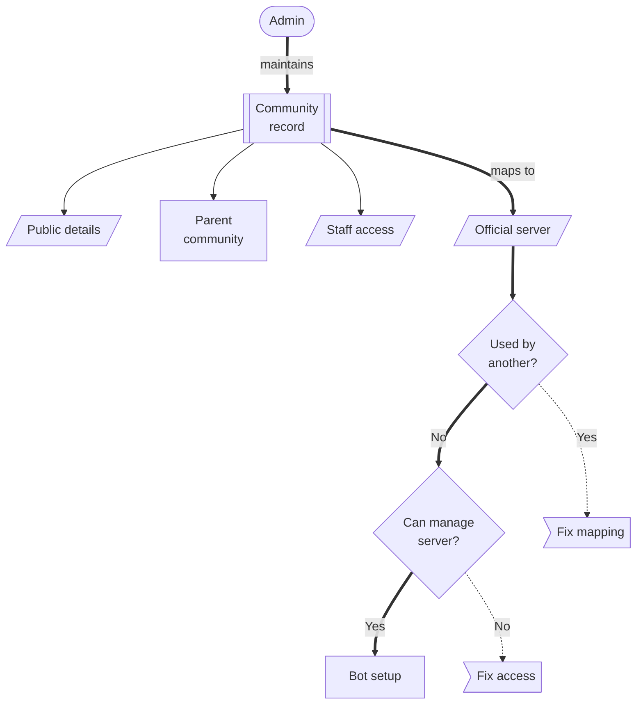

# Community Setup

A Citizen iD community represents a Star Citizen group, organization, server, or related community space.
It is the record that connects public community identity, admin ownership, community hierarchy, and the official Discord server used by automation.

Community setup should be treated as an operational control point.
If the record points at the wrong Discord server, has a confusing slug, or keeps stale staff access, the bot and support workflows can behave correctly from Citizen iD's point of view while still surprising your members.

**Diagram: Community record boundary.**
Community admins maintain the record, Citizen iD uses it as the anchor for community features, and Discord remains its own permission system.

**what should be on the screenshot/diagram:** A current community details screen showing display name, short display name, community type, homepage, official Discord server, description, slug, parent community, and staff access.

Read the diagram as a setup boundary.
The community record is where Citizen iD knows which community is being managed.
The Discord server mapping tells bot features and linked-role instructions which server belongs to the community.
A Discord server that is already assigned to another community needs a mapping correction before setup can continue.
Discord permissions still decide whether a requested role or nickname change can actually happen.
Record fields, parent relationships, and staff access explain the community context around that server mapping.

## First Setup Path

Use this order when you are preparing a community for the first time:

1. Sign in to Citizen iD with an account that can administer the community's Discord server.
2. Open the Community Portal and create or select the community record.
3. Set the display name, short display name if useful, community type, homepage, description, and slug.
4. Choose the parent community only if this record belongs under an existing community group.
5. Select the official Discord server that the Citizen iD bot should use.
6. Confirm the selected server is the same server where members will expect roles, nicknames, or linked-role instructions to work.
7. Review staff access before handing configuration work to another admin.
8. Continue to [Discord Bot](/community-admins/discord-bot) to invite the bot and confirm the Discord-side permissions.

This page owns the community record.
The bot page owns the Discord install and feature tabs.

## Core Details

Community records can include:

- Display name.
- Short display name.
- Community type.
- Homepage.
- Official Discord server.
- Description.
- Slug.
- Parent community.
- Staff-managed membership or access.

The display name is the ordinary name shown to people.
The short display name can help child communities display with parent context in compact places.
The homepage should point to the community surface members expect.
The description should explain the community in a way that still makes sense outside your Discord server.

The stored slug is short and identity-like.
Keep it readable enough for support reports and stable enough that future admins will recognize it.

Parent communities can group related communities.
Child communities are intended for one shallow level of grouping, such as one parent community with several related sub-communities.
Citizen iD does not treat community hierarchy as an unlimited folder tree.

Child slugs include the parent slug as part of their stored identity.
That keeps public identity stable and helps support distinguish related communities that share similar names.

::: tip Slug stability
Choose a slug as if members, support staff, and future admins will use it in screenshots and support reports.
Changing identity-like fields later can make old instructions, links, audit references, and member reports harder to interpret.
:::

## Setup Checklist

Use this checklist before configuring bot automation:

1. Confirm the community name and description are recognizable.
2. Confirm the slug is stable and not a temporary abbreviation.
3. Confirm the homepage is the public surface you want people to associate with the community.
4. Confirm the official Discord server is the exact server where the Citizen iD bot should operate.
5. Confirm the selected parent community, if any, matches the way the community should appear publicly.
6. Confirm staff access before assigning automation responsibility to another admin.
7. Confirm the community is not being duplicated when a parent or child record would be the better fit.

## Staff Access

Staff access should follow operational responsibility.
Give access to people who maintain community identity, Discord mapping, role rules, nickname rules, branding assets, or support escalations.

Review staff access when:

- A community changes leadership.
- A Discord server is replaced or reorganized.
- A moderator starts or stops handling Citizen iD support.
- A developer no longer needs community admin access.
- A parent or child community relationship changes.

Do not share a single admin account.
Individual access makes it easier to understand who changed a setting and who can answer questions about it later.

## Discord Mapping

The official Discord server mapping is the bridge between the community record and bot-managed Discord features.
Set it before relying on role assignments, nickname management, or linked-role instructions.

The selected official Discord server should be a server where the admin can see and administer the server in Discord.
This helps prevent accidental mappings to a server the community cannot actually operate.

If the wrong server is selected, the bot can appear installed and healthy somewhere else while members in the intended server see no useful effect.
When troubleshooting, always compare the community slug, the official Discord server, and the actual Discord server where the member reported the issue.

::: warning Changing the server
Changing the official Discord server can affect bot configuration, role assignment targets, nickname templates, audit interpretation, and member instructions.
Treat it as an operational change rather than a cosmetic edit.
:::

## Change Safety

Use deletion and major edit flows carefully.
Community configuration can affect bot behavior, role assignments, nickname management, branding placements, maintenance notices, and developer applications associated with the community.

Before a major change, collect:

- The community slug.
- The previous and intended display names.
- The previous and intended Discord server.
- The affected child communities, if any.
- The role and nickname automation that depends on the record.
- The reason for the change.

Community removal is permanent in the current admin flow.
It can remove related community members, roles, applications, and authorizations.
Do not use deletion as a cleanup shortcut when a rename, staff access update, or Discord mapping correction would solve the real problem.

## Support Notes

For setup issues, include the community slug, the visible community name, the official Discord server, the UTC time of the attempted change, and the non-secret error message.
If the issue involves Discord selection, include whether the bot is installed in the expected server and whether the admin account can see and administer that server in Discord.
