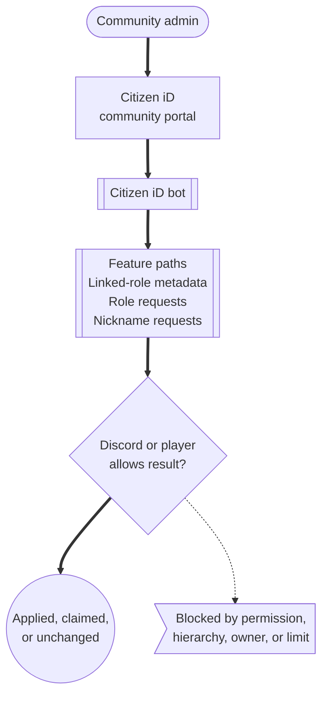

# Discord Bot

The Citizen iD Discord bot connects community configuration to Discord server behavior.
It is the bridge between Citizen iD account facts and the Discord features your community chooses to enable.

The bot can support Discord linked-role setup, role assignment automation, nickname automation, moderation-related configuration, and resync operations.
Discord still controls server permissions, role hierarchy, linked-role user interface, nickname limits, and server-owner protection.

**Diagram: Bot responsibility boundary.**
Community admins configure the bot, Citizen iD evaluates the rule, and Discord decides whether the requested server change is allowed.

**what should be on the screenshot/diagram:** A boundary diagram showing the community admin, Citizen iD bot tabs, Discord server permissions, managed roles, managed nicknames, and blocked Discord outcomes.

Read the diagram as a permission flow.
Citizen iD can request the Discord change only after your configuration says the member should receive it.
Discord can still refuse the change because the bot lacks permission, the bot role is too low, the member is protected by role hierarchy, or the requested nickname does not fit Discord rules.
Linked roles use a different Discord claim flow.
Citizen iD supplies metadata, and the player claims the role in Discord.

## First Bot Setup Path

Use this order after the community record points at the correct official Discord server:

1. Start from the trusted Citizen iD bot install path.
2. Choose the exact Discord server selected on the community record.
3. Confirm the Discord application name before authorizing the install.
4. Grant the permissions needed for the features you plan to use.
5. Move the Citizen iD bot role above every Discord role it should assign or every member group whose nickname it should manage.
6. Return to the Community Portal and confirm the General, Roles, Nicknames, and Moderation areas can see the expected server.
7. Configure one feature at a time, then preview or resync before telling members the feature is live.

## Setup Expectations

Install the official Citizen iD bot only through the trusted Citizen iD install path or the official Discord application link provided by Citizen iD.
During the Discord install flow, confirm the application name and choose the exact server you administer.

Grant the Discord permissions required by the features you plan to use.
Role automation needs role-management ability.
Nickname automation needs nickname-management ability.
Linked roles also require Discord-side role configuration by a server admin.

Place the bot role high enough in the Discord role hierarchy for managed roles and members.
The bot cannot manage roles above itself.
The bot cannot manage protected members such as the server owner or members whose highest role outranks the bot.

Return to Citizen iD and configure the bot from the community portal.

<ImageStepper
  title="Existing Discord bot installation screens"
  note="what should be on the screenshot/diagram: Current production screenshots for the official bot invite, server picker, requested permissions, and Discord role hierarchy with the Citizen iD role above managed roles."
  :items="[
    {
      src: '/images/discord-bot-install.png',
      alt: 'Discord bot installation dialog for Citizen iD.',
      title: 'Install bot',
      caption: 'Shows the Discord-side installation dialog used to add the Citizen iD bot.',
      description: 'Start from the official bot invite path and confirm that the request names the expected Citizen iD application before continuing.'
    },
    {
      src: '/images/discord-bot-install-server.png',
      alt: 'Discord bot installation server selection dialog.',
      title: 'Choose server',
      caption: 'Shows the Discord server selection step during bot installation.',
      description: 'Select the community server you administer, because the bot can only manage the server where it is installed and permitted.'
    },
    {
      src: '/images/discord-bot-server-roles.png',
      alt: 'Discord server roles page showing role ordering priority.',
      title: 'Check hierarchy',
      caption: 'Shows the Discord role hierarchy that affects whether the bot can manage roles and nicknames.',
      description: 'Place the Citizen iD bot role above roles it must assign or members whose nicknames it must manage.'
    }
  ]"
/>

After install, check these setup facts before enabling automation:

1. The bot is installed in the same server selected as the community's official Discord server.
2. The bot has the Discord permissions required by the enabled features.
3. The bot role is above every Discord role it should assign or remove.
4. The bot role is high enough to manage nicknames for the intended members.
5. The admins configuring Citizen iD also understand the Discord-side role hierarchy.

## Configuration Areas

The community bot configuration is organized around General, Roles, Nicknames, and Moderation.

The General area is for broad bot and server context.
The Roles area is for role assignment templates, preview, audit, and role-related resync.
The Nicknames area is for nickname template fields and server nickname resync.
The Moderation area is for moderation-related configuration when available.

**what should be on the screenshot/diagram:** A current Citizen iD community portal screenshot showing the General, Roles, Nicknames, and Moderation tabs with the selected official Discord server visible.

Role, permission, and server-state changes in Discord usually take a few minutes to become visible in Citizen iD.
Some server or bot state can remain stale longer.
If you just moved a role, granted a permission, or installed the bot, wait briefly, try the relevant preview or resync action, and escalate only if the portal still contradicts the Discord state after about twenty minutes.

::: tip Permission checklist
When a tab reports a permission problem, check both sides.
Your Discord user may need permission to manage that feature, and the bot may also need permission to apply changes on the server.
:::

Admins with Discord role-management permission can request a manual role update through the bot command surface.
Members who believe their roles are out of sync should report the affected server, role, and time to community staff so an admin can check audit evidence and resync safely.

## Linked Role Setup

Linked roles are Discord roles that players claim through Discord's own linked-role interface.
Citizen iD supplies account metadata to Discord, but the player still returns to Discord to claim the role.
Do not describe linked roles as roles directly assigned by Citizen iD.

Linked-role setup has two parts.
Admins configure the Discord role requirement.
Members then use Discord's linked-role claim interface to connect or authorize Citizen iD and claim the role.

<ImageStepper
  title="Existing Discord linked role setup screens"
  note="what should be on the screenshot/diagram: Current Discord screenshots showing People or Roles settings, the Links tab, Add requirement, Citizen iD as the connected app, and the linked-role requirement selector."
  :items="[
    {
      src: '/images/discord-bot-server-role-links.png',
      alt: 'Discord server settings page showing role links.',
      title: 'Open role links',
      caption: 'Shows the Discord server settings area where role links are managed.',
      description: 'Use this area when configuring a Discord role that players can claim after Citizen iD metadata confirms the requirement.'
    },
    {
      src: '/images/discord-bot-server-role-add-link.png',
      alt: 'Discord dialog for adding a role link connection.',
      title: 'Add connection',
      caption: 'Shows the connection dialog used when adding Citizen iD as a linked-role provider.',
      description: 'Choose the Citizen iD connection only for roles whose claim requirement should be backed by Citizen iD account state.'
    },
    {
      src: '/images/discord-bot-server-role-configure-link.png',
      alt: 'Discord linked role requirements configuration dialog.',
      title: 'Configure requirement',
      caption: 'Shows the requirement selection step for a Discord linked role.',
      description: 'Select requirements that match the access rule you want players to satisfy before Discord allows the role claim.'
    }
  ]"
/>

The admin setup path is:

1. Open Discord server settings.
2. Open the role that players should be able to claim.
3. Use the role Links or requirements area.
4. Add Citizen iD as the connected application requirement.
5. Choose the Citizen iD-backed requirement that matches the access rule.
6. Save the Discord role configuration.
7. Tell members how to open Discord linked roles, connect or authorize Citizen iD when prompted, return to Discord, and claim the role.

You can include Discord's `<id:linked-roles>` message link in member instructions when that helps members open the linked-role menu directly.

**what should be on the screenshot/diagram:** A member-facing Discord announcement that says which linked role to claim, where to open Linked Roles, what Citizen iD account state is required, and that the final claim happens in Discord.

Linked roles are different from bot-managed role assignments.
Linked roles are claimed through Discord's own linked-role interface.
Bot-managed role assignments are applied by the Citizen iD bot according to templates configured in Citizen iD.
If a linked role does not apply, check the Discord linked-role requirement, the member's Citizen iD account link, and Discord's claim screen before troubleshooting bot role assignment templates.

## Troubleshooting

When the bot appears installed but automation does not work, check the cause in this order:

1. The community record points to the correct official Discord server.
2. The bot is present in that server.
3. Discord has finished reflecting recent permission and hierarchy changes.
4. The bot role is above the roles or members it must manage.
5. The Citizen iD feature tab is enabled and configured.
6. The affected player has a Citizen iD account linked to the expected Discord account.
7. The role assignment or nickname template has the data it needs.

::: details Details for bot support reports

Include:

- The community slug.
- The Discord server name and ID if available.
- The affected role or nickname.
- The affected member.
- The UTC time of the failed or unexpected change.
- Whether the bot role is above the target role or member.
- Whether the relevant tab showed a permission warning.
- Whether a manual resync was attempted.

Do not post bot tokens, private Discord messages, or unrelated member data in public support channels.

:::
