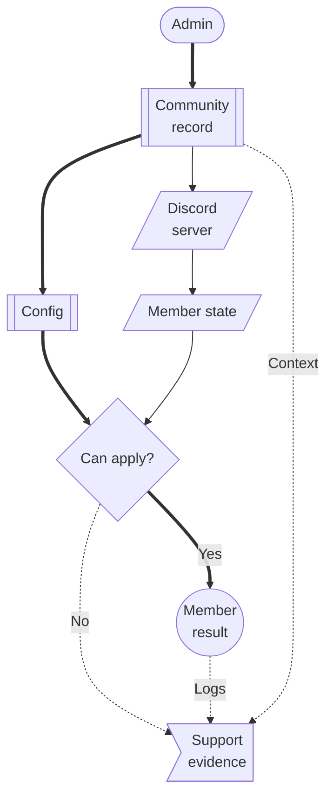

# Community Admin Guide

Citizen iD helps Star Citizen community admins operate identity-aware community workflows.
It can connect a community record, a Discord server, role automation, nickname templates, community branding, and support evidence into one operating model.

The most important idea is that Citizen iD does not decide how every community should run.
Community admins choose the rules for their community.
Citizen iD evaluates those configured rules.
Discord, third-party tools, and player account settings can still affect whether the intended result can be applied.

This guide separates community administration from community development.
Use it when you manage a community, configure the Citizen iD bot, maintain role automation, review audit logs, update community presentation, or support members.

**Diagram: Admin operating map.**
The map shows the main control and evidence path that all admin features share.

**what should be on the screenshot/diagram:** A current admin journey map that shows admins maintaining the community record, choosing configuration, checking external state, producing member-visible results, and collecting support evidence.

Read the diagram as an ownership map.
Community setup anchors the public record, staff access, and the official Discord server.
Configuration covers bot setup, role rules, nickname templates, branding, and maintenance choices.
Player account state, Discord server state, and RSI public data can all affect whether configured automation can apply.
Support collects evidence from the workflow that produced the surprise instead of assuming one single cause.
The developer guide is separate from this map because OAuth applications and API integrations need more technical detail than ordinary community administration.

## Start Here

If this is the first setup for a Discord community, use this path:

1. Sign in to Citizen iD with an account that also has the needed Discord server permissions.
2. Open the Community Portal and create or select the community record.
3. Confirm the display name, slug, homepage, description, parent community if any, and official Discord server.
4. Invite the official Citizen iD bot to that same Discord server.
5. Place the bot role above the roles or members it needs to manage.
6. Return to Citizen iD, confirm the bot configuration tabs can see the server, and choose whether you want linked roles, bot-managed roles, nickname management, branding, or maintenance notices.
7. Preview or test one small rule before rolling automation out to the whole server.

Use this reference order when you are setting up or troubleshooting a specific community feature.
Each item points to the page that answers the practical question behind the task.

1. Start with [Community Setup](/community-admins/community-setup) when you need to confirm the community record, slug, parent community, homepage, description, official Discord server, or admin responsibilities.
2. Use [Discord Bot](/community-admins/discord-bot) when you are installing the bot, checking permissions, choosing configuration tabs, or setting up Discord linked roles.
3. Use [Role Assignments](/community-admins/role-assignments) when you need to grant or remove Citizen iD roles or Discord roles from account, Discord, RSI, or organization conditions.
4. Use [Nickname Management](/community-admins/nickname-management) when the server should format member nicknames from Citizen iD and player profile fields.
5. Use [Branding Assets](/community-admins/branding-assets) when you are preparing community visuals, previewing placements, or responding to asset review feedback.
6. Use [Maintenance And Support](/community-admins/maintenance-and-support) when something is blocked, delayed, out of sync, or needs escalation with safe evidence.

## Core Concepts

Community administration has four recurring boundaries.

- The community controls its own rules, templates, staff access, and member-facing explanations.
- Citizen iD stores community configuration, evaluates configured identity rules, and records useful audit evidence.
- Discord controls final Discord permissions, role hierarchy, server ownership, nickname limits, linked-role surfaces, and rate limits.
- Players control their Citizen iD account links, RSI verification state, privacy settings, and third-party application consent.

When an outcome looks wrong, first identify which boundary is involved.
A missing Discord role can be a Citizen iD rule mismatch, a stale Discord server mapping, a bot permission problem, a role hierarchy problem, or a player account-state problem.
Those causes need different fixes.

::: tip Admin control
Citizen iD can apply the rules you configure, but it does not decide your community policy.
Write your rules, role names, nickname formats, and member instructions so moderators can explain them without reading implementation details.
:::

## Common Journeys

<dl>
  <dt><strong>I want to add Citizen iD to a Discord server.</strong></dt>
  <dd>Confirm the community record, install the official bot in the correct server, place the bot role above managed roles and members, then configure only the bot features you intend to use.</dd>
  <dt><strong>I want verified players to get a server role.</strong></dt>
  <dd>Configure a role assignment template, choose a condition that matches verified account state or approved RSI data, choose the Discord role target, preview the result, then watch the audit log after rollout.</dd>
  <dt><strong>I want Discord nicknames to follow one format.</strong></dt>
  <dd>Choose the nickname fields, check how unavailable fields should appear, confirm the bot can manage member nicknames, then resync when the template is ready.</dd>
  <dt><strong>I need to explain a role dispute.</strong></dt>
  <dd>Find the member, template, role, UTC time, audit entry, Discord permission state, and whether manual resync was attempted before escalating.</dd>
</dl>

## Not Covered

This guide is not a developer API manual.
Use the [Community Developer Guide](/community-developers/) for OAuth applications, OpenID Connect, scopes, claims, tokens, and API reference material.

This guide is also not a guarantee that every Discord action will succeed.
Discord can block role or nickname changes when the bot lacks permission, sits too low in the role hierarchy, hits a platform limit, or tries to manage a protected member.

::: warning When automation surprises members
Do not assume every unexpected role or nickname means a Citizen iD outage.
Check the community rule, the player account state, the Discord permission state, and the audit evidence before escalating.
:::

Community admins manage a community's operational setup.
Community developers build tools that integrate with Citizen iD through OAuth, OpenID Connect, and APIs.
Some people do both, but the docs keep the workflows separate so each path stays readable.

## Manual Depth

The manual is layered so admins can work quickly but still explain decisions to members.

- The main sections explain the normal operating path first.
- Lists capture setup checks, permission checks, and repeatable support evidence.
- Diagrams show ownership and failure branches that are easy to miss in prose.
- Expandable detail blocks hold edge cases, safety notes, and escalation detail.
