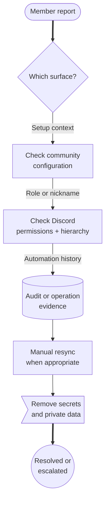

# Maintenance And Support

Community admins need operational tools as much as configuration tools.
Citizen iD supports community-scoped maintenance notices and role-assignment audit trails, but support still works best when admins collect safe, specific evidence.

Use this page when a member report is unclear, a bot action looks delayed, a maintenance notice blocks access, or a Citizen iD support escalation needs enough context to be useful.

**Diagram: Admin support path.**
Start with the member report, check the community-owned configuration, collect audit or permission evidence, try the safe recovery action, and escalate only with non-secret context.

**what should be on the screenshot/diagram:** A support workflow showing player report, admin checks, bot permission or hierarchy check, audit lookup, manual resync, safe screenshot, and escalation to Citizen iD support.

Read the diagram as an escalation filter.
Many issues can be explained by the community rule, Discord permissions, or a recent sync delay.
Escalation is still important, but it should include the facts support needs and exclude anything private.

## Maintenance Windows

Community-scoped maintenance can target community-managed modules.
Community-managed maintenance can cover surfaces such as authorization, the community portal, and the developer portal when those targets are available to the community.

Maintenance windows have start and end times, enabled state, and audience targeting.
Platform-locked maintenance rows are controlled by Citizen iD staff and cannot be changed by community admins.

**what should be on the screenshot/diagram:** A current maintenance UI screenshot showing create or edit notice, audience targeting, start time, end time, enabled state, and platform-locked rows that community admins cannot edit.

Use community maintenance when the community needs to warn members about planned admin work or community-managed service interruptions.
Do not use maintenance notices to hide policy changes, unresolved permission problems, or ordinary member support requests.

::: tip Maintenance ownership
If the row is community-managed, the community owns the wording and timing.
If the row is platform-locked, treat it as a Citizen iD platform notice and do not promise that community admins can clear it.
:::

## Role Evidence

For role assignment issues, collect evidence before changing the template.
The useful question is not only "what role is missing?" but also "which rule evaluated, what target was planned, and whether Discord allowed the final change."

Include:

- The community slug.
- The Discord server.
- The affected member.
- The affected role.
- The role assignment template, if known.
- The UTC time of the event or report.
- The audit entry or operation ID when available.
- Whether the member recently joined, changed linked accounts, changed RSI data, or changed privacy settings.
- Whether a manual resync was attempted.
- Whether the bot role is above the target role.

## Nickname Evidence

Some nickname failures may not create a detailed admin-visible audit row today.
If a nickname did not change, treat the missing update itself as part of the evidence and compare it with the template, bot permissions, role hierarchy, and member state before escalating.

For nickname issues, collect:

- The community slug.
- The Discord server.
- The affected member.
- The nickname template fields.
- The nickname that appeared.
- The nickname you expected.
- The UTC time of the event or report.
- Whether server-wide resync was attempted.
- Whether the bot has the needed nickname-management ability.
- Whether the bot role is above the member's highest relevant role.

Discord can block nickname updates for reasons Citizen iD cannot override.
That includes missing permissions, role hierarchy, the server owner, protected members, and nickname limits.

## Safe Screenshots

Screenshots help when they show only the relevant state.
They become risky when they include private Discord messages, unrelated member lists, private account details, tokens, authorization codes, or full callback URLs.

**what should be on the screenshot/diagram:** A safe support screenshot showing only page title, request ID, UTC time, non-secret error text, and cropped non-private state.

Before sharing a screenshot, hide:

- Tokens.
- Authorization codes.
- Email addresses.
- Private account IDs.
- Private Discord messages.
- Unrelated member information.
- Private exports or full account data.

When possible, capture only the error message, request ID, page title, selected community slug, and visible non-secret configuration state.

## Escalation

Escalate to Citizen iD support when:

- The community portal blocks a valid admin action.
- A platform-locked maintenance notice appears wrong or stale.
- Audit evidence contradicts the visible role result.
- A role or nickname action fails even though configuration, bot permissions, and hierarchy look correct.
- A suspected privacy or account-boundary issue needs staff review.

Use the [official support Discord](https://discord.citizenid.space) or the support contact listed in the current legal pages for sensitive issues.
Do not rely on public channels for private account evidence.

Citizen iD does not promise a specific uptime, support-time, role-sync, or service-level commitment.
Set member expectations accordingly when a report depends on Discord availability, Citizen iD maintenance, third-party availability, or manual support review.

## Shared Reference

See [Support Evidence](/reference/support-evidence) for a cross-audience checklist.
See [Operations Notes](/reference/operations-notes) for shared operational boundaries.
