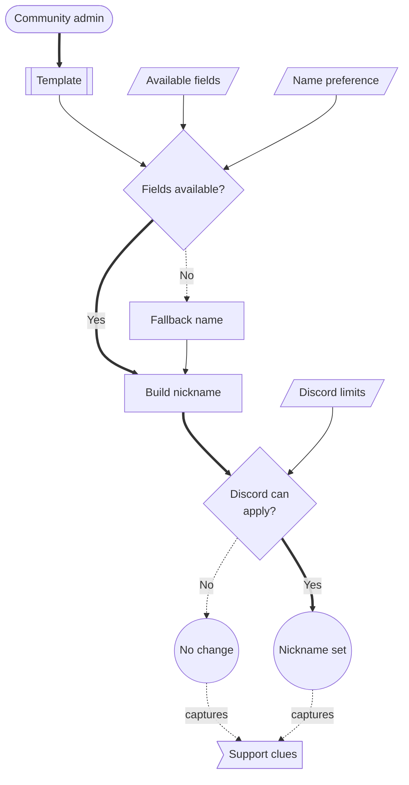

# Nickname Management

Citizen iD can manage Discord nicknames for a community server.
Nickname management is useful when a community wants server names to follow a recognizable pattern such as RSI handle, community display name, primary organization context, or a combination of several fields.

Nickname management is template-based.
The community chooses fields, Citizen iD composes the nickname from available account data, and Discord decides whether the bot can apply it.

**Diagram: Nickname application path.**
The template uses available player data, handles unavailable fields, checks Discord constraints, and either applies the nickname, falls back, or leaves the Discord nickname unchanged.

**what should be on the screenshot/diagram:** A nickname flow showing template fields, available player data, missing or fallback fields, Discord 32-character limit handling, permission check, and applied, fallback, or unchanged nickname.

Read the diagram as a constraint map.
The template can be correct while Discord still blocks the nickname because of permission, role hierarchy, owner protection, or nickname length.
Missing fields can also lead to fallback behavior before Discord receives the final nickname.
Today, some nickname failures may appear to admins as no visible nickname change rather than a detailed admin-visible audit entry.
Collect safe evidence before escalating.

## How It Works

Choose the fields that should appear in the nickname template.
Citizen iD composes a Discord-safe nickname from the available account information.
Discord nickname limits still apply.

The current implementation keeps generated nicknames within Discord's 32-character limit.
When the configured fields cannot produce a useful guild nickname, Citizen iD can fall back to the member's ordinary Discord display name.

Available nickname data can come from Citizen iD account data, verified RSI account data, and RSI primary organization data.
Only use a field when the community understands what happens if the field is missing for a member.

Common template ideas include:

- RSI handle only.
- Citizen iD display name only.
- Server-specific display-name preference.
- Display name followed by RSI handle.
- Primary organization context plus player name.
- A community-specific prefix or suffix combined with one player field.

Keep templates short.
A format that looks good for a short handle can become unreadable or clipped for longer names.

**what should be on the screenshot/diagram:** Current screenshots of the nickname template controls, available field list, previewed generated nickname, and the resync confirmation dialog.

## Player Preferences

Some templates can use player display-name preferences.
Players can set or remove global and server-local display-name preferences through Citizen iD bot account commands where the bot is present.
Players can use `/account set-display-name server-display-name:<YOUR_DISPLAY_NAME>` to set a server-preferred display name for compatible nickname templates.
Players can use `/account unset-display-name server-display-name:<YOUR_DISPLAY_NAME>` to reset that server preference to the default.
See [Discord Integrations](/players/discord-integrations#player-commands) for the player-facing command context.

Use these preferences only when the community is comfortable letting members choose part of the nickname.
If the community needs strict RSI-handle naming, use a template that does not depend on a member-controlled display-name field.

When a field is unavailable, the generated result may need a fallback or may omit the unavailable value depending on the configured field behavior.
Tell members which account setup or privacy setting affects the field before asking them to contact Citizen iD support.

## Operational Notes

The bot needs Discord permission to manage nicknames.
The bot role must be high enough in the server role hierarchy.
The bot cannot change the server owner.
The bot also cannot manage members whose highest role outranks the bot.

Some admin surfaces can also depend on the Discord permissions of the admin using the portal.
If the Nicknames tab reports a permission problem, check both the bot's Discord permissions and the current admin's Discord permissions.
The current portal may require the admin configuring nickname automation to have Discord role-management authority for the server, even though the Discord action itself depends on nickname-management ability.
If the tab stays unavailable after nickname permissions look correct, also check whether the current admin can manage roles in that server.

Manual resync is useful when Discord state and Citizen iD state appear out of sync.
The Nicknames tab can request a server-wide nickname resync, and the confirmation warns that the operation may take a while.

## Troubleshooting

When a nickname is wrong, check:

1. The member has a Citizen iD account linked to the expected Discord account.
2. The template uses fields that are available for that member.
3. The member's privacy settings allow any field the template depends on.
4. The bot has nickname-management permission.
5. The bot role is above the member's highest relevant role.
6. The generated nickname fits Discord's nickname rules.
7. A recent template, role, permission, or account change has had time to sync.

For nickname issues, collect:

- The community slug.
- The Discord server.
- The affected member.
- The template fields.
- The nickname that appeared.
- The nickname you expected.
- The UTC time.
- Whether server-wide resync was attempted.
- Whether Discord showed a permission or hierarchy problem.

For broader escalation guidance, use [Maintenance And Support](/community-admins/maintenance-and-support).

::: warning Enforcement expectations
If nickname management is enabled, a member changing their Discord nickname manually may be corrected by the bot later.
Explain this in server rules so members know whether the nickname format is optional, recommended, or enforced.
:::

::: details Details for unavailable fields

Unavailable fields are usually caused by account state, privacy settings, missing provider links, incomplete RSI verification, or a template that expects data the member does not have.
Do not ask members to publish private account information in a Discord channel to prove the field manually.
Use safe support evidence and private support paths when sensitive account data is involved.

:::
