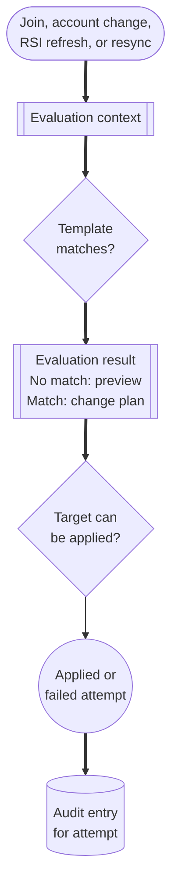

# Role Assignments

Role assignments are the core community-admin automation model for Citizen iD.
They let a community describe when a member should receive or lose Citizen iD community roles, Discord roles, or supported role-like outcomes based on account and community context.

Think of a role assignment as a rule with three parts: when this is true, apply these targets, and keep evidence of what happened.
That model is more flexible than one-off verified-role setup, but it also means admins should preview and document rules before relying on them.

**Diagram: Role assignment path.**
A trigger builds context, templates evaluate conditions, matching targets are planned, Discord or Citizen iD changes are attempted, and attempted role changes can produce audit evidence.

**what should be on the screenshot/diagram:** A role assignment workflow showing trigger or resync, evaluation context, condition result, no-change preview explanation, target application, Discord or Citizen iD role change attempt, and audit entry for attempted changes.

Read the diagram as a safe rollout model.
The template match is only one part of the result.
Preview is the best place to explain no-match and no-change cases before live automation runs.
Audit evidence is most useful when Citizen iD attempts a Discord role change and records whether that attempt succeeded or failed.
Do not expect every member who matches no template to produce an audit entry.
The target still has to be valid, and Discord can still block a Discord role change because of permission or hierarchy.

## First Verified-Member Role

For a first rule, start with one simple verified-member role before building organization-specific or rank-specific templates.

Use this path:

1. Confirm the official Discord server is selected on the community record.
2. Confirm the Citizen iD bot is installed and its role is above the Discord role you want to assign.
3. Create a role assignment template named in plain language, such as "Verified RSI member".
4. Choose the condition in the builder that represents completed RSI verification or the verified account state your community accepts.
5. Choose one Discord role target from the official server.
6. Preview a member who should match and a member who should not match.
7. Enable the template only after the preview matches the community policy.
8. Tell members that the role depends on their linked Discord account, Citizen iD account, RSI verification state, and Discord server membership.
9. Watch the audit view after rollout for attempted Discord role changes and failures.

Keep the first rollout small.
It is easier to explain one verified-member role than a deeply nested rule that combines verification, organization data, existing Discord roles, and profile privacy choices.

## Template Anatomy

A role assignment template has a display name, description, group, order, condition, targets, and enabled state.

Use the display name and description as member-support tools, not only as internal labels.
When a member asks why a role changed, a clear template name is much easier to explain than a hidden rule tree.

Groups and order help organize several templates that belong to the same policy area.
Enabled state lets you keep a draft or temporarily disable a template without deleting its structure.

Conditions can inspect Citizen iD state, Discord state, profile settings, RSI profile data, RSI profile details, and RSI organization membership when the needed data is available.
Composite conditions let you combine requirements, such as verified RSI account plus a Discord role, or public organization membership plus a minimum RSI profile age.

Targets can assign supported Citizen iD roles or Discord roles.
Some templates can also express outcomes connected to RSI organization context.
Citizen iD does not change a player's RSI organization membership on RSI.

::: tip Write rules like policy
If the community policy is "verified main-organization members get the Flight Crew role," use names and descriptions that say that plainly.
That makes preview, audit, and member support easier later.
:::

## Common Conditions

Role assignment conditions should map to community policy, not to hidden implementation language.
Useful admin-facing examples include:

- The member has a linked Citizen iD account.
- The member has completed RSI verification.
- The member has or does not have a particular Citizen iD role.
- The member has or does not have a particular Discord role on the official server.
- The member's profile visibility allows the data required by the rule.
- The verified RSI profile matches a specific RSI profile requirement.
- The RSI profile is old enough for the community's policy.
- The public RSI organization membership matches the expected organization, membership type, role, or rank.

If a condition depends on public RSI or organization data, explain that to members.
Privacy settings or missing public data can affect whether the condition can be evaluated the way the community expects.

## Common Targets

Targets are the outcomes that apply when a template matches.
Typical targets include:

- Add or remove a Citizen iD community role used by community tools.
- Add or remove a Discord server role.
- Apply a supported organization-context outcome used by the community's role model.

For Discord role targets, the bot must be able to manage the target role.
The target role must be below the bot role in Discord.
The role must belong to the expected official server.
The normal Discord role picker avoids managed roles such as linked roles, because those belong to Discord's linked-role mechanism rather than ordinary bot role assignment.

## Preview Before Applying

Use preview before relying on a new or changed template.

Preview builds an evaluation context, applies templates, and reports the resulting role state before live changes are made.
Preview is also the safest place to test custom RSI organization membership cases.
Use it before enabling a template that affects many members.

Planned role assignment screenshot sequence:

1. **what should be on the screenshot/diagram:** The role assignment template editor with display name, description, group, order, and enabled state visible.
2. **what should be on the screenshot/diagram:** The condition builder showing a completed RSI verification condition selected for a first verified-member role.
3. **what should be on the screenshot/diagram:** The target selector showing one Discord role target from the official Discord server.
4. **what should be on the screenshot/diagram:** The preview context editor with a representative member selected.
5. **what should be on the screenshot/diagram:** The preview result showing why the member will or will not receive the target role.
6. **what should be on the screenshot/diagram:** The audit log filtered to the template, affected member, role target, and operation time.

Preview is a support tool as much as a configuration tool.
When a member report is hard to reproduce, preview can help you compare the member's expected state with the rule's actual inputs.

## Audit And Resync

Role assignment changes are audited.
Audit entries are scoped to the community and can be filtered by outcome, date range, and operation details.

Admins with Discord role-management permission can request a server role update through the bot command surface.
Members can ask staff for a manual role update when they believe Discord roles are out of sync.
Community admins should use audit entries when escalating support.

For role issues, collect:

- The community slug.
- The Discord server.
- The affected member.
- The affected Citizen iD role or Discord role.
- The template name, if known.
- The UTC time.
- The audit entry or operation ID when available.
- Whether a manual resync was attempted.
- Whether the bot role is above the target Discord role.

For broader escalation guidance, use [Maintenance And Support](/community-admins/maintenance-and-support).

## Safe Rollout

Use this rollout pattern for new or risky templates:

1. Name the policy in plain language.
2. Build the condition and target.
3. Preview several representative members.
4. Check Discord role hierarchy for every Discord target.
5. Enable the template during a time when staff can watch reports.
6. Review audit entries after the first sync.
7. Update member-facing instructions if the rule changes who gets access.

::: warning Avoid silent policy changes
Role assignment templates can remove access as well as grant it.
When a template represents a meaningful community policy change, tell moderators and affected members what changed before the next sync surprises them.
:::

::: details Details for advanced rules

Role assignment templates have implementation limits so one community rule cannot become unbounded.
The current default model supports up to 25 templates per community, 10 conditions per template, 5 items in one composite condition, and 2 nested composite levels.
If your policy needs many deeply nested branches, split it into clearer templates before asking for a limit increase.

Role sync work is coordinated per Discord guild member so the same member is not processed by overlapping sync work at the same time.
That coordination improves consistency, but it does not remove Discord permission failures, Discord caching delays, or third-party availability issues.

Avoid using OAuth scopes or token claims as admin-facing rule explanations.
Those terms belong in the community developer guide unless an admin is also building a third-party application.

:::
