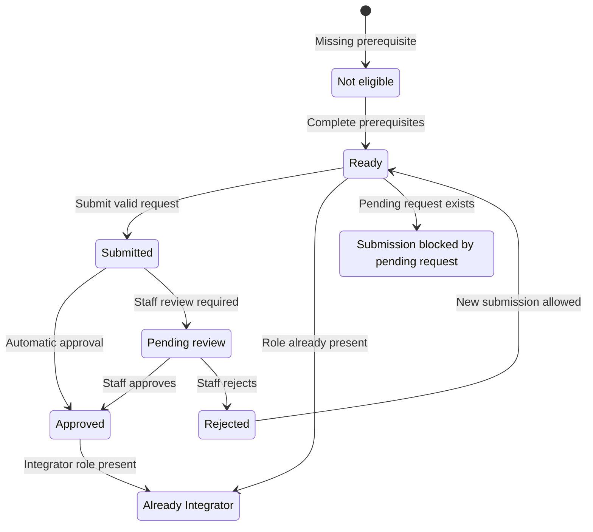

# Get Access

When complete, Jordan will have submitted an eligible Integrator request for the fictional Asteria Dispatch application and will know how to recognize the resulting state.

## Scenario Context

<ScenarioContext fixture="asteria" focus="access" />

## Before You Start

### Who Can Apply

Apply with the signed-in Citizen iD account that will operate the application.
The server evaluates the account, linked identities, official Discord membership, existing Integrator role, pending requests, submitted fields, and current Developer Terms acceptance when you submit.
This guide documents visible prerequisites and results, not internal allowlists, thresholds, scoring, or review policy.

### Required Accounts

Complete Citizen iD verification and link Discord before opening the request.
Roberts Space Industries operates the Star Citizen account and profile system, and Citizen iD verification connects the applicant to that profile.
After that first expansion, this guide refers to Roberts Space Industries as <Abbr term="RSI" />.
Join the official Citizen iD Discord server with the linked Discord account.
If membership has just changed, return to the dialog and use its bounded `Refresh` action rather than submitting repeatedly.

### Developer Terms

Read the current Developer Terms of Use linked by the portal.
Acceptance applies to the version recorded at submission time, so review the notice again for a later request if the portal presents it.
The request is blocked with `The Developer Terms of Use notice must be accepted.` until the notice is accepted.

| Input | Ready value | Blocked result | Recovery |
| --- | --- | --- | --- |
| Signed-in Citizen iD account | Present | Application dialog cannot establish an applicant. | Sign in. |
| Roberts Space Industries verification | Complete | `Verify Citizen iD account` remains incomplete. | Complete account verification. |
| Linked Discord account | Present | `Link Discord account` remains incomplete. | Link Discord and return to the dialog. |
| Official Discord membership | Present | `Join the official Discord server` remains incomplete. | Join, wait for propagation, and use the bounded refresh action. |
| Existing Integrator role | Absent | `This account already has integrator access.` | Continue to the developer portal instead of submitting. |
| Pending request | Absent | `This account already has a pending integrator application.` | Wait for review instead of submitting another request. |
| Required form fields | Valid | Exact validation message appears and no request is stored. | Correct the named field and resubmit. |
| Developer Terms notice | Accepted | `The Developer Terms of Use notice must be accepted.` | Review and accept the current notice. |

## Submit Request

### Goal

Submit one complete request that tells Citizen iD staff what Asteria Dispatch does, who uses it, which features it needs, and how member data will be protected.

### Configuration

Use the current portal fields and synthetic Asteria values.
Representational State Transfer Application Programming Interface is spelled out here before the exact portal label uses REST API.

| Portal field | Requirement | Limit or choices | Asteria example |
| --- | --- | --- | --- |
| `What kind of tools and applications do you want to build?` | Required | 2,000 characters | `Asteria Dispatch is a community website that lets members sign in and view dispatch tools.` |
| `Which features of CiD are you going to use and how?` | Required | 2,000 characters | `Use Citizen iD sign-in and the REST API with minimal scopes, server-side token storage, and member-controlled revocation.` |
| `Intended use` | At least one | `public`, `organization-internal`, `personal` | `public`. |
| `Citizen iD feature targets` | At least one | Sign-in, account linking, REST API, or other | Sign-in and REST API. |
| `Describe the other feature target(s)` | Required only when `Other` is selected | 400 characters | Not shown. |
| Developer Terms notice | Required | Accepted or not accepted | Accepted after Jordan reviews the linked terms. |

The table reproduces `CiD` only where it appears in the current portal label.
In all other prose, use Citizen iD.

### Applicant State

Jordan is signed in as `developer@example.invalid`, verified, linked to Discord, and present in the official Citizen iD Discord server.
Jordan is not already an Integrator and has no pending request.

### Working Example

Describe the target audience, concrete features, relevant `.invalid` site link, covered use cases, and privacy approach.
The first description names the community website and member outcome.
The second description names Citizen iD sign-in and the REST <Abbr term="API" />, then limits requested scopes and keeps tokens on the server.
Select only `public`, sign-in, and REST <Abbr term="API" /> for this scenario, and accept the current terms notice after reviewing it.

### Expected Result

The server stores one submitted request if every precondition and field remains valid at submission time.
If configured automatic approval is enabled, the same service approval path grants the Integrator role and the portal refreshes Jordan's identity.
Otherwise, the request remains pending for staff review.
The portal does not expose the approval-mode configuration, so the path becomes observable only after submission.

### Member Effect

No Asteria Rescue member sees a change when Jordan receives developer access.
Integrator approval lets Jordan manage developer applications; it does not authorize an application for a member or grant community data.

### Verify It

Reopen the account settings developer-access area after submission.
An approved account displays `This account already has integrator access.` and can continue to the developer portal.
A submitted request awaiting staff action displays `The application is pending review.` and blocks a duplicate request.
A rejection ends the pending state, and a new request is possible only while the account is still eligible and does not already hold the Integrator role.

### Failure Branches

| Trigger | Visible result | Stored request | Safe retry | Member effect | Privacy-safe evidence |
| --- | --- | --- | --- | --- | --- |
| Missing verification, Discord link, or official membership | The corresponding timeline item remains incomplete. | No | Complete the named prerequisite, return, and refresh once if membership changed. | None | Incomplete step name, environment, and redacted timestamp. |
| Existing Integrator role | `This account already has integrator access.` | No new request | Open the developer portal. | None | Visible status without account identifiers. |
| Existing pending request | `This account already has a pending integrator application.` | Existing request only | Wait for review. | None | Visible status and submission time without private identifiers. |
| Invalid or missing field | The exact validator message names the missing or over-limit field. | No | Correct that field and submit once. | None | Exact message, selected non-sensitive choices, and character count. |
| Terms not accepted | `The Developer Terms of Use notice must be accepted.` | No | Review and accept the current notice. | None | Terms version shown by the portal and exact error. |
| Discord membership is not observed after joining | `Join the official Discord server` remains incomplete. | No | Wait for propagation and use the bounded `Refresh` action. | None | Timestamp, environment, and step state without a Discord user identifier. |
| Approval path fails after storing the request | The portal presents the returned approval error and the request may remain pending. | Yes | Do not resubmit; contact support with the request state. | None | Exact error and request timestamp without private identifiers. |

### Support Evidence

Record staging or production, the exact incomplete step or validation message, the attempted time in Coordinated Universal Time, whether `Refresh` was used, and whether the portal shows pending or approved.
After spelling it out once, use <Abbr term="UTC" /> for the time standard.
Do not include email addresses, Discord identifiers, account identifiers, cookies, authorization codes, or tokens in support material.

## Automatic Approval

### Applicant State

Jordan satisfies every precondition, the submission is valid, and the environment's server-side `AutoApprove` policy is enabled when the request is submitted.

### Expected Result

Citizen iD first stores the submitted request, then uses the same service-level approval path used by staff review.
The Integrator role is granted, the request is recorded as approved, and the portal refreshes Jordan's signed-in identity before continuing.

### Verify It

Confirm that the developer portal becomes available and that the account-settings dialog displays `This account already has integrator access.`
Do not infer automatic approval from eligibility alone.

### Failure Branches

If role granting or approval persistence fails, keep the stored request state and returned error together as evidence.
Do not submit a duplicate while the portal reports a pending request.
Contact Citizen iD support privately if the request state and portal access disagree.

## Manual Review

### Applicant State

Jordan satisfies every precondition and submits in an environment where automatic approval is disabled.
Production may require this path even when staging approved a separate request automatically.

### Expected Result

The request remains submitted and the portal reports `The application is pending review.` until Citizen iD staff approve or reject it.
Staff review is authoritative, and this guide makes no promise about an invisible scoring rule or review time.

### Verify It

Wait for the visible state to change.
Approval adds the Integrator role and unlocks the developer portal.
Rejection removes the pending condition but does not grant the role.

### Failure Branches

Do not create another request while the pending message is present.
After rejection, review the current terms and prerequisites before a new submission because product state may have changed.
If the request remains pending beyond the communicated review window, gather privacy-safe evidence and contact support.

### Support Evidence

Provide the environment, request creation time, visible status, application purpose, and exact returned error if one exists.
Send this evidence through a private support path without personal data or authentication material.

## Next Step

After the Integrator role is visible, continue to [Choose Client](/community-developers/client-types).
Do not register Asteria Dispatch until its runtime, secret boundary, redirect records, intended grant, and required staff permissions are recorded.
