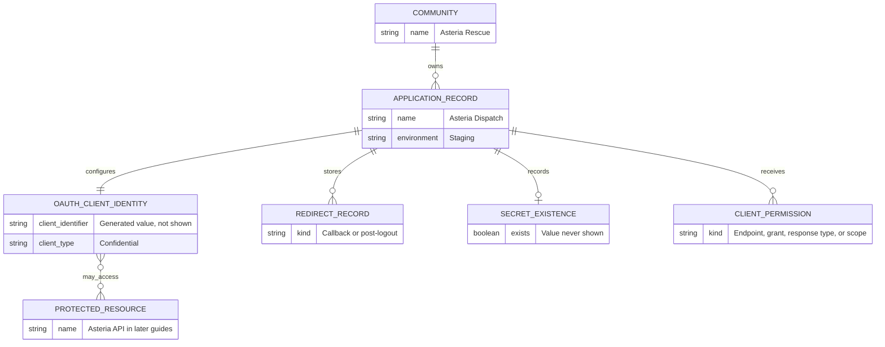

# Register App

When complete, you will have verified staging [application records](/community-developers/terms#application-record) for the four Asteria runtimes and a safe recovery plan for each generated [client secret](/community-developers/terms#client-secret).

## Scenario Context

<ScenarioContext fixture="asteria" focus="applications" />

## Before You Start

### Confirm Access

Sign in with Jordan's verified account and confirm the Integrator role is visible before opening the developer portal.
If it is not visible, return to [Get Access](/community-developers/access) and resolve the current request state.

### Confirm Community

Asteria Rescue must already exist and be selectable in Jordan's developer portal context.
This guide does not create a community or claim a more specific ownership or membership rule.
If Asteria Rescue is absent, stop and ask its community administrator to follow [Community Setup](/community-admins/community-setup).
Resume only after the community is selectable.
Contact Citizen iD support when an existing community should be selectable but is not.

### Choose Environment

Staging and production are separate security boundaries.

| Contract | Staging | Production |
| --- | --- | --- |
| Exact issuer | `https://citizenid.dev/` | `https://citizenid.space/` |
| Portal origin | `https://citizenid.dev` | `https://citizenid.space` |
| Integrator eligibility and approval | Evaluated in staging | Evaluated separately in production |
| Client records and credentials | Staging-only | Production-only |
| Redirect records | Explicit staging application values | Recreated and rechecked for production |
| Wrong-environment result | Issuer, client, redirect, or credential validation fails | Issuer, client, redirect, or credential validation fails |

Keep the issuer's trailing slash exactly as published.
Never reuse a [client identifier](/community-developers/terms#client-identifier) or secret across environments.
Treat discovery as authorization-server capability metadata, not proof that a particular client may use every advertised feature.

Before calling a feature usable, confirm all four conditions:

1. The environment discovery document advertises the server capability.
2. The stored application has the required client type and exact redirect configuration.
3. Citizen iD staff have assigned the required endpoint, grant, response-type, scope, and requirement permissions.
4. A bounded staging smoke test succeeds.

### Prepare Values

Use only the Asteria fixture or equally obvious `.invalid` replacements while learning the portal.
Use `REPLACE_WITH_GENERATED_CLIENT_ID` for a client identifier and `STORE_IN_SECRET_MANAGER` for a confidential secret destination.
Never place a secret-shaped example in documentation, source, browser code, screenshots, logs, issues, tickets, chat, or command history.

Developer-configurable fields are:

| Field | Developer action | Safety boundary |
| --- | --- | --- |
| Community | Select Asteria Rescue. | Stop if the expected existing community is absent. |
| Application Name | Enter the fixture application name. | Do not include personal data or credentials. |
| Application Type | Select `Web` or `Native` from the completed worksheet. | `Service` is a runtime purpose, not a third portal value. |
| Client Type | Select `Confidential` or `Public`. | Use `Confidential` only when an operator-controlled server protects the secret. |
| Allowed Redirect URIs | Enter each exact callback record. | Use HTTPS for web callbacks and no wildcard, fragment, user-information component, or open redirector. |
| Post-Logout Redirect URIs | Enter the exact fixture value when specified. | A stored value is configuration, not proof that discovery exposes an end-session endpoint. |

Each redirect value is a Uniform Resource Identifier (URI), and redirect forms have different platform boundaries.
A claimed-HTTPS native redirect requires an HTTPS origin and platform association controlled by the application publisher.
A loopback redirect is for a native desktop listener and should use the loopback interface according to the client platform's tested flow.
A private-use scheme is an application-specific redirect such as Asteria Mobile's `com.example.invalid.asteria.mobile:/oauth/callback`, but another installed application may try to claim the same scheme.
This Start journey records the fixture's private-use scheme without claiming the public native exchange is usable.

### Know Staff Controls

The portal also displays generated or staff-controlled values:

| Field | Owner | Integrator boundary |
| --- | --- | --- |
| Client ID | System generated | Read and store the identifier for the correct environment without treating it as a secret. |
| Client Secret | System generated for a confidential client | Store the one-time value on creation or reset; the value cannot be retrieved later. |
| Consent Type | Citizen iD staff | Read-only to an ordinary Integrator. |
| Permissions | Citizen iD staff | Endpoint, grant, response-type, scope, audience, and resource entries are read-only to an ordinary Integrator. |
| Require Proof Key for Code Exchange | Citizen iD staff | The portal requirement is read-only, while every public authorization-code client must still use S256 end to end. |
| Require Pushed Authorization Requests | Citizen iD staff | The read-only field does not create a protocol endpoint. |

Proof Key for Code Exchange protects authorization-code redemption with a per-request challenge and verifier.
After that first expansion, this page refers to it as <Abbr term="PKCE" />.
Every public authorization-code flow must send `code_challenge_method=S256` and later present the matching `code_verifier`, even if the staff-controlled requirement is disabled.
S256 <Abbr term="PKCE" /> is also recommended for confidential authorization-code clients.
Never use the `plain` challenge method.

Pushed Authorization Requests require both `pushed_authorization_request_endpoint` in discovery and applicable client permission.
After that first expansion, this page refers to them as <Abbr term="PAR" />.
Neither environment advertised the endpoint on 2026-07-20, so this guide does not present <Abbr term="PAR" /> as usable.

## Register Web App

### Goal

Create Asteria Dispatch as a confidential server-side application for interactive member sign-in.

### Configuration

| Field | Asteria Dispatch value |
| --- | --- |
| Environment | Staging |
| Community | Asteria Rescue |
| Application Name | Asteria Dispatch |
| Application Type | `Web` |
| Client Type | `Confidential` |
| Allowed Redirect URI | `https://dispatch.example.invalid/auth/citizenid/callback` |
| Post-Logout Redirect URI | `https://dispatch.example.invalid/auth/citizenid/signed-out` |
| Secret result | Generated once and stored as `STORE_IN_SECRET_MANAGER` |

The intended minimum permissions are authorization and token endpoints, the authorization-code grant, the `code` response type, and `openid` plus `profile` scopes.
Report missing or broader defaults to Citizen iD staff instead of changing read-only permissions or requesting unrelated ones.

### Working Example

Open the staging developer portal and create an application in the Asteria Rescue context.
Enter the configuration exactly, save it, and copy the one-time secret directly into the Dispatch server's secret manager before closing the dialog.
Record the generated identifier as `REPLACE_WITH_GENERATED_CLIENT_ID` in deployment configuration.
Do not put the secret in a local source file or browser-facing configuration.

::: info Screenshot specification
The safe synthetic authenticated portal state is not demonstrably available, so publish no account screenshot yet.
When an isolated synthetic fixture is available, capture only the application dialog fields for Community, Application Name, Application Type, Client Type, Allowed Redirect URIs, Post-Logout Redirect URIs, Permissions, and Requirements.
Crop out browser chrome, account navigation, identifiers, and the secret dialog.
Annotate developer-configurable fields separately from generated and staff-controlled fields.
Use the caption `Asteria Dispatch staging registration with developer controls separated from staff controls.`
Use alt text that describes the field grouping and selected synthetic values without reproducing any secret or private identifier.
:::

The stored relationships are:

### Expected Result

The application grid contains Asteria Dispatch with Application Type `Web`, Client Type `Confidential`, a generated client identifier, and an available secret-reset action.
The stored redirect records match the worksheet exactly.
The one-time secret is no longer retrievable after the dialog closes.

### Member Effect

Registration alone makes no visible change for Alex, Blake, Casey, or Devon.
A member is affected only after a later interactive flow requests authorization, and the member retains consent and revocation control.

### Verify It

Separate stored values from granted permissions and tested behavior.

| Check | Expected stored value | Granted or tested status |
| --- | --- | --- |
| Environment and issuer | Staging and `https://citizenid.dev/` | Discovery rechecked before the smoke test. |
| Owning community and name | Asteria Rescue; Asteria Dispatch | Stored only. |
| Application Type and Client Type | `Web`; `Confidential` | Stored only. |
| Redirect records | Exact Dispatch callback and post-logout values | Callback tested later; post-logout remains configuration until discovery exposes a usable end-session endpoint. |
| Secret | Exists without displaying its value | Token-endpoint authentication tested later from the server. |
| Endpoints and grant | Authorization, token; authorization code | Staff-assigned values inspected. |
| Response type and scopes | `code`; `openid`, `profile` | Staff-assigned values inspected. |
| Proof Key for Code Exchange policy | Read-only requirement recorded | S256 used by the later bounded test. |
| Delegation permissions | None required by Start | Report unexpected grants. |
| Next test | No test completed by registration | Run a bounded staging authorization-code test in the Build guide. |

### Failure Branches

| Trigger | Visible result | Record saved | Safe retry | Member effect | Privacy-safe evidence |
| --- | --- | --- | --- | --- | --- |
| Missing or invalid required field | The portal displays its validation message. | No | Correct only the named field and save again. | None | Exact message and redacted field names. |
| Unsafe or duplicate redirect | The portal displays the redirect validation result where validation rejects it. | No or unchanged | Replace it with the exact safe fixture <Abbr term="URI" /> and save once. | None | <Abbr term="URI" /> shape using `.invalid`, without query data. |
| Asteria Rescue is unavailable | The expected community cannot be selected. | No | Complete the community-admin handoff or contact support. | None | Environment and missing community name. |
| One-time secret is lost | The secret cannot be retrieved after the dialog closes. | Yes | Use [Reset Secret](#reset-secret) before any deployment. | None | Application name and confirmation that the value was not retained. |

### Support Evidence

Provide the environment, application name, generated client identifier, expected portal field, exact validation result, permission names, and a timestamp in Coordinated Universal Time.
After that first expansion, this page refers to the time standard as <Abbr term="UTC" />.
Do not include the secret, token, authorization code, cookie, personal data, or a screenshot containing private identifiers.

## Register Browser App

### Goal

Create Asteria Console as a browser interface backed by a confidential server that owns all Citizen iD tokens.

### Configuration

Backend for Frontend names the server boundary that exchanges the code and holds the secret and tokens.
After that first expansion, this page refers to it as <Abbr term="BFF" />.

| Field | Asteria Console value |
| --- | --- |
| Application Type | `Web` |
| Client Type | `Confidential` |
| Allowed Redirect URI | `https://console.example.invalid/auth/citizenid/callback` |
| Post-Logout Redirect URI | `https://console.example.invalid/auth/citizenid/signed-out` |
| Token custodian | Console backend |
| Secret result | Generated once and stored by the backend |

The intended minimum permissions match Asteria Dispatch: authorization and token endpoints, authorization-code grant, `code`, `openid`, and `profile`.

### Working Example

Create the record in staging with Asteria Rescue selected.
Store the generated secret in the Console backend's secret manager.
Configure the browser to use only the Console application session, with the Citizen iD secret and tokens unavailable to browser JavaScript.

### Expected Result

The portal stores a confidential web application for the Console backend.
The browser bundle contains no client secret, access token, or refresh token.

### Verify It

| Check | Stored state | Granted or tested state |
| --- | --- | --- |
| Identity | Asteria Console under Asteria Rescue in staging | Client identifier used only by the matching environment. |
| Client and redirects | `Web` / `Confidential`; exact Console callback and post-logout record | Interactive callback tested later from the backend. |
| Secret and token custodian | Secret exists; Console backend is custodian | Browser inspection confirms no Citizen iD secret or token is exposed. |
| Permissions | Authorization, token, authorization code, `code`, `openid`, `profile` | Staff-assigned values inspected before the bounded test. |
| Requirements and delegation | Read-only <Abbr term="PKCE" /> policy recorded; no Start delegation requirement | S256 used later; unexpected permissions reported. |

### Failure Branches

| Trigger | Visible result | Record saved | Safe retry | Member effect | Privacy-safe evidence |
| --- | --- | --- | --- | --- | --- |
| Secret or tokens would reach browser JavaScript | Architecture review fails before protocol testing. | May be saved | Move exchange and custody to the backend before testing. | No sign-in should launch. | Component boundary and redacted data-flow trace. |
| Staff permission mismatch | Stored read-only permissions are missing or broader than the minimum. | Yes | Report the exact permission names to Citizen iD staff. | Flow remains unavailable. | Client identifier and permission names only. |
| Wrong-environment client or redirect | Issuer, client, redirect, or credential validation fails. | Record exists in its own environment | Select matching staging values and retry once. | Sign-in fails before usable authorization. | Issuer with trailing slash, redacted request metadata, and exact error. |

## Register Native App

### Goal

Store Asteria Mobile's intended public record while retaining a visible `Capability pending` state.

### Configuration

| Field | Asteria Mobile value |
| --- | --- |
| Application Type | `Native` |
| Client Type | `Public` |
| Allowed Redirect URI | `com.example.invalid.asteria.mobile:/oauth/callback` |
| Post-Logout Redirect URI | None |
| Secret result | No secret |
| Intended flow | Authorization code with S256 <Abbr term="PKCE" /> |

The intended minimum permissions are authorization and token endpoints, authorization-code grant, `code`, `openid`, and `profile`.
The portal record does not prove that the token endpoint accepts secretless authentication.

### Working Example

Create the public native record with the exact private-use redirect and no secret.
Keep deployment blocked because the 2026-07-20 discovery snapshot omits the `none` token-endpoint authentication method in staging and production.
Do not add a secret to mobile, desktop, command-line, or other distributed code.

### Expected Result

The application grid can show a `Native` / `Public` record with no secret and the exact redirect.
**Capability pending** remains the protocol result until discovery and a bounded staging exchange prove secretless authorization-code redemption with S256.

### Verify It

| Check | Stored state | Granted or tested state |
| --- | --- | --- |
| Identity | Asteria Mobile under Asteria Rescue in staging | Environment-specific client identifier recorded. |
| Client and redirect | `Native` / `Public`; exact private-use callback; no post-logout record | Redirect ownership and platform handling still require application testing. |
| Secret | No secret | No distributed secret exists. |
| Permissions | Intended authorization, token, authorization code, `code`, `openid`, `profile` | Staff assignments inspected. |
| Proof Key for Code Exchange | S256 required by the application design | Every test sends `code_challenge_method=S256` and matching `code_verifier`. |
| Public exchange | Stored record only | Blocked until discovery advertises `none` and a bounded staging test succeeds. |

### Failure Branches

| Trigger | Visible result | Record saved | Safe retry | Member effect | Privacy-safe evidence |
| --- | --- | --- | --- | --- | --- |
| Discovery omits secretless authentication | `none` is absent from token-endpoint authentication methods. | Yes | Keep `Capability pending` and contact support. | No native sign-in is offered. | Issuer, discovery field name, and dated value set. |
| Secretless redemption fails | Token endpoint returns the bounded test error. | Yes | Stop testing and report the redacted response. | Authorization cannot complete. | Status, error code, correlation data, and no authorization code or token. |
| Redirect is not safely claimed | Platform validation or callback routing fails. | Yes | Fix the platform association or choose a standards-compliant redirect form, then update the exact record. | Authorization cannot return safely. | Platform, <Abbr term="URI" /> shape, and redacted result. |

## Register Service

### Goal

Create Asteria Sync as a confidential background service with no member context.

### Configuration

| Field | Asteria Sync value |
| --- | --- |
| Application Type | `Web` |
| Client Type | `Confidential` |
| Allowed Redirect URI | None |
| Post-Logout Redirect URI | None |
| Token custodian | Sync service secret manager |
| Secret result | Generated once |
| Intended grant | Client credentials |

The minimum Start permissions are the token endpoint and client-credentials grant, with no response type or member scope.
Any later protected-resource scope must be explicitly necessary and staff-assigned for that resource.

### Working Example

Create the record in staging without an interactive redirect.
Store the generated secret directly in the Sync service's secret manager.
Configure the service to authenticate only as Asteria Sync.

### Expected Result

The portal stores a confidential `Web` record because `Service` is the runtime purpose rather than a portal Application Type.
Client credentials identify Asteria Sync itself and never prove member presence or authorize member impersonation.

### Verify It

| Check | Stored state | Granted or tested state |
| --- | --- | --- |
| Identity | Asteria Sync under Asteria Rescue in staging | Environment-specific client identifier recorded. |
| Client and redirects | `Web` / `Confidential`; no redirect records | No interactive browser flow is attempted. |
| Secret | Exists without displaying its value | Stored only in the Sync secret manager and tested later from the service. |
| Permissions | Token endpoint and client-credentials grant | Staff assignments inspected; no member scopes inferred. |
| Response, requirements, delegation | No response type; read-only requirements recorded; no delegation permission required by Start | Unexpected permissions reported before testing. |
| Next test | No capability proven by registration | Run a bounded staging client-credentials request for the intended resource. |

### Failure Branches

| Trigger | Visible result | Record saved | Safe retry | Member effect | Privacy-safe evidence |
| --- | --- | --- | --- | --- | --- |
| Token endpoint or client-credentials permission missing | Token acquisition is unavailable even though the record exists. | Yes | Ask staff to reconcile the minimum permissions. | None | Client identifier, permission names, and exact error. |
| A member identity is required | The chosen flow cannot produce member context. | Yes | Return to [Choose Client](/community-developers/client-types) and choose an interactive design. | No member is impersonated. | Required outcome and flow name without member data. |
| Production credential used against staging or the reverse | Issuer, client, or credential validation fails. | Yes, in its original environment | Restore the matching environment configuration and retry once. | None | Exact issuer, deployment name, and redacted error. |

## Reset Secret

### Goal

Replace a lost or compromised confidential secret without exposing either the old or new value.

::: danger Reset is immediately disruptive
The current implementation replaces the one stored secret immediately when reset succeeds.
No overlap period is documented, so deployments still using the previous value can no longer authenticate.
:::

Prepare the secret manager update, deployment rollout, bounded token-acquisition check, and rollback decision before selecting `Reset Application Secret`.
The new value is displayed once and cannot be retrieved later.

### Expected Result

Citizen iD stores only the newly generated secret.
Store it in the secret manager before closing the dialog, update deployments, verify token acquisition, and remove the previous value from operator-controlled stores.
Do not promise zero downtime because no overlap period exists.

### Verify It

Confirm the application still has a secret without recording its value in the application grid or support evidence.
Run one bounded token-acquisition check from the intended server runtime against the matching environment.
Confirm deployments use the new secret and the previous value no longer authenticates.

### Failure Branches

| Trigger | Visible result | Stored state | Safe retry | Member effect | Privacy-safe evidence |
| --- | --- | --- | --- | --- | --- |
| New one-time value is lost | The secret cannot be retrieved after the dialog closes. | New secret already replaced the old one | Reset again after preparing the destination. | Interactive or service authentication remains unavailable. | Reset time, application name, and deployment state without values. |
| Deployment still uses previous value | Token acquisition fails after reset. | New secret active | Update the secret manager reference and redeploy before another bounded test. | Existing sessions may differ, but new token acquisition fails. | Deployment version, issuer, and redacted error. |
| Suspected compromise | Usage may be unauthorized. | Reset replaces the stored value | Reset, audit usage, revoke affected grants or tokens where appropriate, and contact support privately. | Members may need to authorize again if grants are revoked. | Timeline, affected client identifier, and redacted audit evidence. |
| Reset or subsequent token test fails | Portal or token endpoint displays an error. | Determine from the application grid without exposing the value | Stop repeated attempts and contact support. | Authentication may remain unavailable. | Exact error, environment, timestamp, and correlation data. |

## Next Step

Keep the four post-save worksheets with the deployment configuration and move to later Build guides only after stored settings, staff-granted permissions, and testable environment capabilities agree.
Do not use Asteria Mobile until its visible `Capability pending` checks pass.
Do not use a production OAuth debugger or third-party token decoder during testing.
