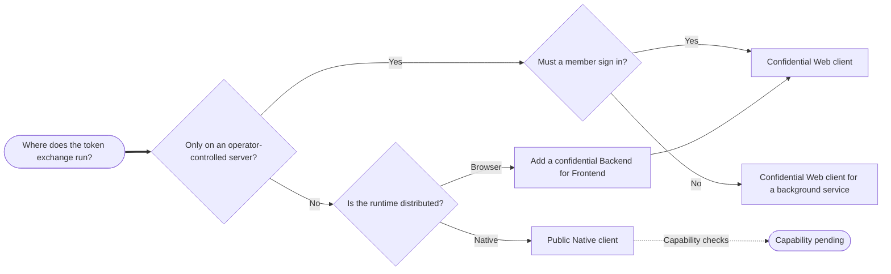

# Choose Client

When complete, you will have a registration worksheet for each Asteria application without placing a secret or token in distributed code.

## Scenario Context

<ScenarioContext fixture="asteria" focus="client-types" />

## Before You Choose

### Identify The Runtime

Start with where the [OAuth client](/community-developers/terms#oauth-client) and authorization-code exchange execute, not with a preferred portal label.
Record answers to these observable questions:

1. Does all token-exchange code run only on a server the operator controls?
2. Which component stores access and refresh tokens?
3. Must the job run when no member is signed in?
4. Does the application need an interactive browser redirect?
5. Which authorization grant must Citizen iD permit for this client?

### Locate The Secret Boundary

A confidential client can protect a secret only when the exchange and secret remain on a server controlled by the operator.
A browser, mobile application, desktop application, or command-line tool is distributed code and cannot protect an embedded secret.
A browser interface can use a confidential Backend for Frontend when that server performs the exchange and keeps tokens unavailable to browser JavaScript.
After that first expansion, this guide refers to Backend for Frontend as <Abbr term="BFF" />.

### List Required Flows

Record whether a member is present, whether an interactive redirect is required, and whether the runtime needs authorization code, refresh token, or client credentials.
Also record the token-endpoint authentication method, refresh-token custodian, exact redirect form, and staff-controlled permissions.
The [token custodian](/community-developers/terms#token-custodian) is the component that stores and uses access or refresh tokens.
[Discovery metadata](/community-developers/terms#discovery-document) reports server capabilities but does not grant a flow to an individual OAuth client.

## Server Website

### Goal

Choose a client for Asteria Dispatch, a server-rendered website with a member present.

### Configuration

Select Application Type `Web` and Client Type `Confidential`.
The Dispatch server stores the secret and tokens, uses the exact HTTPS callback `https://dispatch.example.invalid/auth/citizenid/callback`, and requests the authorization code grant.
Use S256 Proof Key for Code Exchange for the authorization-code flow even though the client is confidential.

### Expected Result

The portal creates a confidential web client and displays its generated secret once.
Store the secret in the server's secret manager before closing the dialog.
Browser code receives neither the client secret nor access and refresh tokens.

### Failure Branches

If any exchange code or token storage must run in the browser, stop and use the Browser App design.
If staff-assigned authorization, token, authorization-code, `code`, `openid`, or `profile` permissions are absent, the stored record is not yet usable for the intended flow.

## Browser App

### Goal

Choose a client for Asteria Console, a browser interface whose confidential backend owns the protocol session.

### Configuration

Treat the browser interface as a Single-Page Application and the Console backend as its <Abbr term="BFF" />.
After that first expansion, this guide refers to Single-Page Application as <Abbr term="SPA" />.
Register the backend as Application Type `Web` and Client Type `Confidential` with `https://console.example.invalid/auth/citizenid/callback`.
The backend performs the code exchange, stores the secret and tokens, and exposes only an application session to browser JavaScript.

### Expected Result

Asteria Console uses the confidential web client owned by its backend.
No browser bundle, browser storage, network response, or frontend log contains a client secret or Citizen iD token.

### Failure Branches

If the browser must redeem the code or store Citizen iD tokens directly, this confidential design no longer applies.
Do not repair that boundary by embedding the secret in the <Abbr term="SPA" />.
Move the exchange and token custody to the backend before registration.

## Native App

### Goal

Record the intended public native design for Asteria Mobile without claiming the current environments can complete it.

### Configuration

The intended portal values are Application Type `Native` and Client Type `Public` with private-use redirect `com.example.invalid.asteria.mobile:/oauth/callback`.
The application creates a fresh S256 Proof Key for Code Exchange challenge for every authorization request and presents the matching `code_verifier` during redemption.
After that first expansion, this guide refers to Proof Key for Code Exchange as <Abbr term="PKCE" />.
Never use the `plain` challenge method and never embed a secret as a workaround.

### Expected Result

**Capability pending:** discovery on 2026-07-20 did not advertise the `none` token-endpoint authentication method in staging or production.
The public native flow remains unavailable in this guide until discovery advertises secretless authentication and a bounded end-to-end staging test proves authorization-code redemption with S256 <Abbr term="PKCE" />.
Repeat both checks in production before treating the production flow as usable.

### Failure Branches

If discovery still omits `none`, stop before implementation even if a `Public` record can be stored.
If a bounded staging test rejects secretless redemption, retain `Capability pending`, capture the redacted response, and contact Citizen iD support.
Do not switch to a confidential native client or distribute a client secret.

## Background Service

### Goal

Choose a client for Asteria Sync, which runs without a signed-in member.

### Configuration

`Service` describes the runtime purpose, not a third portal Application Type.
Select Application Type `Web` and Client Type `Confidential`, store the secret in the Sync service's secret manager, configure no interactive redirects, and request client credentials.
The minimum Start permissions are the token endpoint and client-credentials grant, with no response type or member scope.

### Expected Result

Asteria Sync authenticates as itself in a machine-to-machine exchange.
After that first expansion, this guide refers to Machine to Machine as <Abbr term="M2M" />.
The resulting client identity never proves member presence and cannot impersonate a member.

### Failure Branches

If the job needs a member's identity, consent, or claims, client credentials is the wrong flow.
If staff have not granted the token endpoint and client-credentials grant, registration can exist while token acquisition remains unavailable.

## Compare Choices

| Application | Observable runtime | Member present | Token custodian | Portal Application Type | Portal Client Type | Redirect | Secret | Intended grant | Status |
| --- | --- | --- | --- | --- | --- | --- | --- | --- | --- |
| Asteria Dispatch | Server website | Yes | Dispatch server | `Web` | `Confidential` | Exact HTTPS callback | Generated once | Authorization code | Ready for registration. |
| Asteria Console | Browser plus confidential backend | Yes | Console backend | `Web` | `Confidential` | Exact HTTPS callback | Generated once | Authorization code | Ready for registration. |
| Asteria Mobile | Installed native app | Yes | Native secure storage | `Native` | `Public` | Private-use scheme | No secret | Authorization code with S256 Proof Key for Code Exchange | Capability pending. |
| Asteria Sync | Server background job | No | Sync secret manager | `Web` | `Confidential` | None | Generated once | Client credentials | Ready for registration. |

Confidential authorization-code clients require authorization and token endpoints, the authorization-code grant, the `code` response type, and only the necessary scopes.
Asteria Dispatch and Asteria Console start with `openid` and `profile`.
Asteria Mobile records the same intended minimum but remains capability pending.
Asteria Sync requires only the token endpoint and client-credentials grant at Start.
Citizen iD staff control these endpoint, grant, response-type, scope, and requirement permissions.

## Register Next

Carry this worksheet into [Register App](/community-developers/applications).

| Worksheet field | Asteria Dispatch | Asteria Console | Asteria Mobile | Asteria Sync |
| --- | --- | --- | --- | --- |
| Environment | Staging | Staging | Staging | Staging |
| Owning community | Asteria Rescue | Asteria Rescue | Asteria Rescue | Asteria Rescue |
| Runtime | Server website | Browser plus Backend for Frontend | Installed native application | Server background job |
| Token custodian | Dispatch server | Console backend | Native secure storage | Sync secret manager |
| Application Type | `Web` | `Web` | `Native` | `Web` |
| Client Type | `Confidential` | `Confidential` | `Public` | `Confidential` |
| Redirect records | `https://dispatch.example.invalid/auth/citizenid/callback`; post-logout `https://dispatch.example.invalid/auth/citizenid/signed-out` | `https://console.example.invalid/auth/citizenid/callback`; post-logout `https://console.example.invalid/auth/citizenid/signed-out` | `com.example.invalid.asteria.mobile:/oauth/callback`; no post-logout redirect | No redirects |
| Secret expectation | Generated once | Generated once | No secret | Generated once |
| Intended grants | Authorization code | Authorization code | Authorization code with S256 Proof Key for Code Exchange | Client credentials |
| Required staff permissions | Authorization and token endpoints; authorization-code grant; `code`; `openid`, `profile` | Authorization and token endpoints; authorization-code grant; `code`; `openid`, `profile` | Same intended minimum; capability pending | Token endpoint; client-credentials grant |

Do not continue with a row until the runtime and token custodian agree with its client type.
