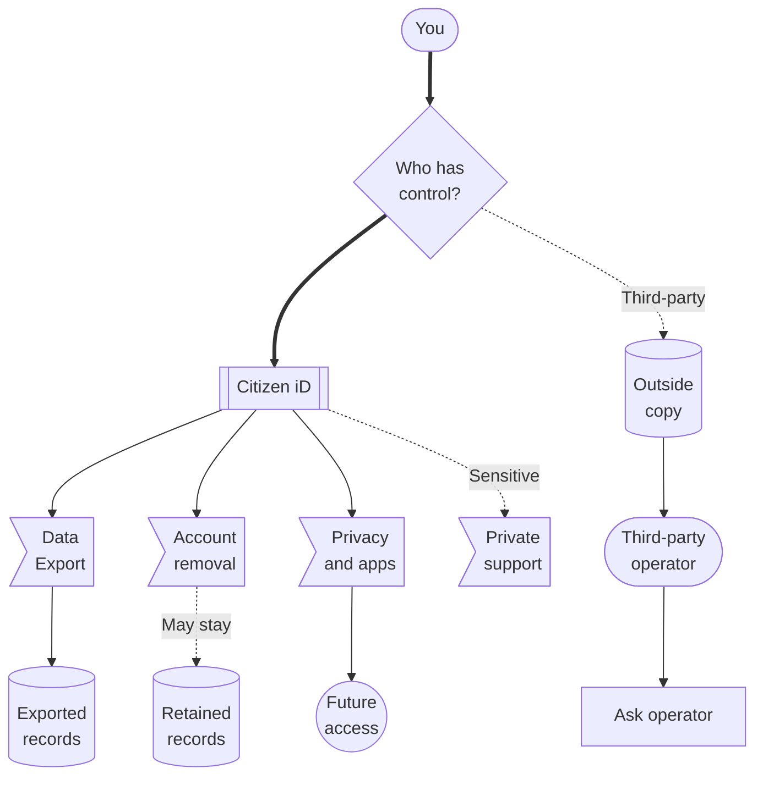

# Data Rights

Use this page when you want to download your Citizen iD data, ask for account removal, or understand why some records may remain outside Citizen iD.
The short version is simple.
Citizen iD can help with data it controls.
Discord, RSI/Spectrum, Google, Twitch, community servers, and third-party applications control their own copies.

Privacy controls, app revocation, linked-account changes, data export, and account removal are related, but they are not the same action.
Changing one of them does not automatically change every other place where information may exist.

::: tip Start with the place that stores the data
Ask Citizen iD about Citizen iD records.
Ask the app, community, Discord server, or provider operator about records they store outside Citizen iD.
:::

**Diagram: Who controls the data.**
Use this as a signpost for the main actions and related pages.

Read the map from the ownership question.
If Citizen iD controls the record, use the Citizen iD branch for export, account removal, privacy controls, app access review, or private support.
If another operator controls the copy, use the outside branch and ask that app, provider, Discord server, or community for export, correction, or deletion.
Privacy controls and app access controls can change future sharing through Citizen iD, but they do not delete old outside copies.

## Download Your Data {#download-your-data}

Use account settings when you want a copy of your Citizen iD account data.
This section covers the [export flow](#export-flow) and [what is included](#what-is-included) in a Citizen iD export.

### Export Flow {#export-flow}

The normal export flow is:

1. Open account settings.
2. Request your account data export.
3. Wait while Citizen iD generates a ZIP archive on demand.
4. Download the ZIP archive when it is ready.
5. Store the export carefully because it can contain personal data.

Repeated export requests may be temporarily blocked to reduce abuse.
If a download fails, wait before retrying and include the request ID when [asking for support](/players/getting-help#privacy-and-data).

Handle the exported file carefully:

- The file name includes your account ID and a timestamp so you can distinguish multiple exports.
- The archive may include private or sensitive account information.
- The archive should stay off public support channels.
- Share only the smallest relevant excerpt if support explicitly asks for it through a safe channel.

::: warning Keep exports private
A full export can contain enough information to expose your account history or help someone impersonate a support issue.
Do not upload it to Discord, GitHub, public forums, or public tickets.
:::

### What Is Included {#what-is-included}

The export is a Citizen iD export.
It can include Citizen iD records that exist for your account.
It does not export data held only by Discord, RSI/Spectrum, Google, Twitch, a community Discord server, or a third-party community application.

The exact contents depend on what you used.
A player who never authorized third-party applications will have fewer application records than a player who used several community tools.
A player who never joined a Citizen iD-managed community may have fewer community records than a community staff member.

Typical export categories can include:

- Account information, such as account ID, username, and display name.
- Sign-in and contact-related records that Citizen iD stores.
- Linked account records, such as Discord, Google, Twitch, or RSI-related links.
- Verified RSI profile information when it exists on your account.
- Community-related records that Citizen iD controls.
- Application authorization records for apps you approved through Citizen iD.
- Approved account facts that Citizen iD may share with an authorized app.
- Discord nickname preferences when you used those features.
- Export information, such as when the archive was generated.

::: tip Missing categories are usually normal
An empty or missing category does not automatically mean something went wrong.
It can simply mean you never used that Citizen iD feature.
:::

## Request Account Removal {#request-account-removal}

Account removal is currently request-only.
Self-service account removal is intended, but it is not the current player flow.
Use the [official support path](/players/getting-help#sensitive-issues) when you need account removal reviewed.
This section covers removal [side effects](#side-effects) and [records that may remain](#records-that-may-remain).

Use private support from the start if the request involves account ownership, deletion, identity review, a dispute, or private screenshots.

In the request, explain:

- Whether you want your Citizen iD account removed.
- Whether you also need help identifying third-party operators that may hold separate copies.
- Whether there is an active support issue.
- Whether there is an active moderation, verification, or community dispute.
- Which contact method support should use for follow-up.

::: warning Removal is not instant erasure everywhere
Removing a Citizen iD account does not automatically delete records stored by Discord, RSI/Spectrum, Google, Twitch, a community server, or a third-party application.
Contact those operators for data they control.
:::

### Side Effects {#side-effects}

Account removal can affect whether provider accounts can be used with Citizen iD again.
An active identity provider link cannot be immediately reused on a different Citizen iD account.
If an RSI account is linked, it can remain locked from being linked to another Citizen iD account after removal.
That restriction exists to reduce duplicate verification, impersonation, and ban evasion.

### Records That May Remain {#records-that-may-remain}

Some records may need to remain after account closure or removal.
This can happen for legal, security, abuse-prevention, moderation, or verification integrity reasons.

Examples can include:

- Security records.
- Abuse-prevention records.
- Legal records.
- Moderation records.
- Verification integrity records.
- Records needed to reduce duplicate RSI verification, impersonation, or ban evasion.

Citizen iD should minimize retention where possible.
Deletion does not always mean every historical trust or safety record can be removed immediately.

::: tip Why this matters
Some communities rely on Citizen iD verification as stable proof of RSI account control.
Removing every historical integrity record immediately could make duplicate verification, impersonation, or ban evasion easier.
:::

## Third-Party Copies {#third-party-copies}

Third-party copies are records stored outside Citizen iD.
They can exist because you signed in to an app, joined a community server, linked a provider, claimed a Discord role, or used a community tool.

Common examples include:

- A community application that stored your profile, roles, RSI status, or email after you approved access.
- A Discord server that stored role, nickname, moderation, or automation history.
- Discord records tied to your Discord account.
- RSI/Spectrum records tied to your RSI account.
- Google or Twitch records tied to those provider accounts.

Revoking an application stops future access through Citizen iD.
It does not erase data the application already received while authorization was active.

Unlinking a provider stops Citizen iD from treating that provider account as connected going forward.
It does not erase records that a provider, Discord server, or third-party app already stored.

Turning off public discovery limits public lookup through Citizen iD.
It does not cancel app authorization, change browser analytics consent, or remove third-party stored copies.

Use these pages for the matching control:

- Use [Privacy Controls](/players/privacy-controls) to change public discovery, app access review, or browser analytics preferences.
- Use [Third-Party Apps](/players/third-party-apps) to review app consent and revoke future app access.
- Use [Linked Accounts](/players/linked-accounts) to understand provider links and unlinking.
- Use [Getting Help](/players/getting-help#privacy-and-data) when you need to collect safe evidence for a data request.

::: danger Third-party data is outside Citizen iD control
Citizen iD cannot export, correct, delete, or guarantee removal of copies stored by a third-party application, Discord server, provider, or community database.
Ask the operator that controls that copy.
:::

## Ask For Help {#ask-for-help}

For privacy or data issues, include only the details needed for support to route the request.
Do not send secrets or full exports in public.

Useful details can include:

- Your Citizen iD account identifier if you can safely provide it.
- Your preferred contact method.
- Whether the request is about export, account removal, discovery, an authorized app, or a third-party copy.
- The application, community, Discord server, or provider name if a third party is involved.
- Whether you already revoked an app, unlinked an account, or changed a privacy setting.
- Whether there is an active support, moderation, verification, or community issue.

If a request involves a third-party application, include the application name and community so support can point you to the right operator when needed.
If the request is only about a third-party copy, the third-party operator is usually the place that can delete or correct it.

::: details Quick checklist

Before sending a privacy or data request, check:

- Did you identify whether the data is stored by Citizen iD or by another operator?
- Did you keep full exports, tokens, private screenshots, and callback URLs out of public channels?
- Did you include the request ID if an export failed?
- Did you mention whether third-party app access was already revoked?
- Did you use private support for deletion, account ownership, or sensitive identity review?

:::
