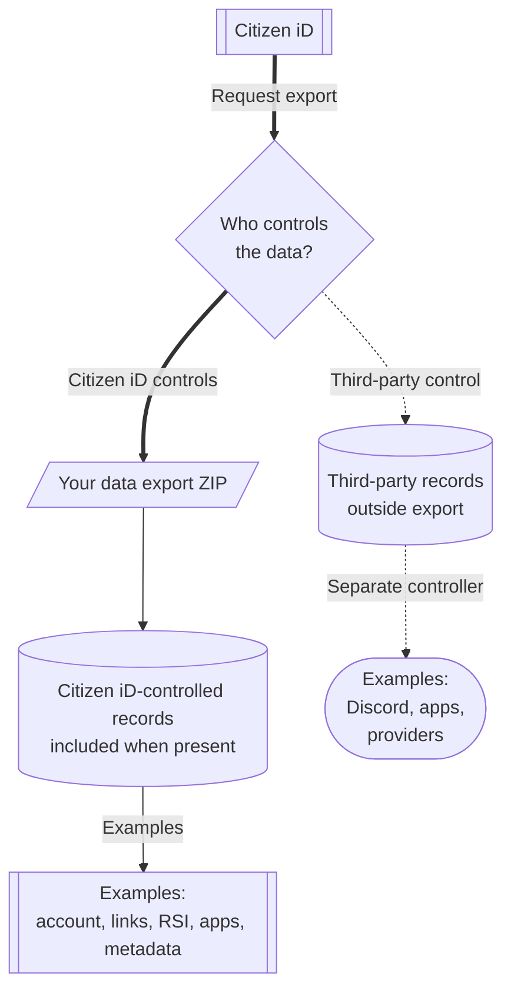

# Data Rights

Citizen iD provides player-facing data export and account removal processes.
These processes cover data controlled by Citizen iD.
They do not automatically control data held only by Discord, RSI/Spectrum, Google, Twitch, a community Discord server, or an external application database.

Use this page when you need a GDPR-style overview of what you can download, what you can request to remove, and what may remain for legal, security, or integrity reasons.

**Diagram: Data export boundary.**
The export contains data controlled by Citizen iD, while third-party systems have their own records outside the ZIP.

Read the first branch as the practical export boundary.
Citizen iD-controlled records can appear in the generated ZIP when they exist on your account.
Third-party-controlled records stay outside that ZIP, even when those systems originally learned something through a Citizen iD-powered flow.

## Download Data

Use account settings to request your personal data export.
The normal export flow is:

1. Open account settings.
2. Request your personal data export.
3. Wait while Citizen iD generates a ZIP archive on demand.
4. Download the ZIP archive when it is ready.
5. Store the export carefully because it can contain personal data.

The export endpoint is rate-limited to reduce abuse, so repeated downloads may be temporarily blocked.
If a download fails, wait before retrying and include the request ID when asking for support.

Handle the exported file carefully:

- The file name includes your account ID and a timestamp so you can distinguish multiple exports.
- The archive can contain personal data.
- The archive should not be uploaded to public support channels.

## Export Contents

The export can include account information, credentials metadata, claims, linked accounts, community data, RSI profile data, OAuth authorization and token metadata, Discord nickname preferences, and export metadata.
The exact contents depend on your account state and the features you used.

Typical export categories include:

- Account information.
- Credentials metadata.
- Claims.
- Linked accounts.
- Community data.
- RSI profile data.
- OAuth authorization and token metadata.
- Discord nickname preferences.
- Export metadata.

For example, a player who never authorized external applications will have less OAuth data than a player who has used several community tools.
A player who never joined a Citizen iD-managed community may have less community data than a community admin or staff member.

::: tip Export scope
The export is a Citizen iD export.
It does not export data held only by Discord, RSI, Google, Twitch, or an external community application.
:::

## Delete Account

Account removal is currently request-only.
Self-service account removal is intended, but it is not the current player flow.
Use the official support path when you need account removal reviewed.

In the request, explain:

- Whether you want only the Citizen iD account removed.
- Whether you also need help understanding third-party data boundaries.
- Whether there is an active support issue.
- Whether there is an active moderation, verification, or community dispute.

## Retained Records

Some records may need to be retained after account closure or removal.
Examples can include:

- Security records.
- Abuse-prevention records.
- Legal records.
- Moderation records.
- Verification integrity records.
- Records needed to prevent duplicate RSI verification or ban evasion.

Citizen iD should minimize retention where possible.
Deletion does not always mean every historical trust or safety record can be removed immediately.

## Third Parties

Revoking an application, unlinking an account, or deleting a Citizen iD account does not automatically delete data held by third-party services.
Contact the relevant third-party controller for data they control:

- The community or application operator for community-tool data.
- The Discord server for server-local moderation, role, or nickname data.
- Discord for Discord account data.
- RSI/Spectrum for RSI/Spectrum account data.
- Google or Twitch for provider account data.

If a third-party application received data from Citizen iD while authorized, Citizen iD can stop future sharing after revocation, but the third-party operator remains responsible for the copy it already stored.

::: details Details for deletion requests

When asking for removal, include:

- Your Citizen iD account identifier if you can safely provide it.
- Your preferred contact method.
- Whether there are active community issues tied to the account.
- Whether there are active application issues tied to the account.

Do not send full data exports unless support explicitly requests a specific excerpt through a safe channel.

If the request involves a third-party application, include the application name and community so Citizen iD support can point you to the right operator when needed.

:::
