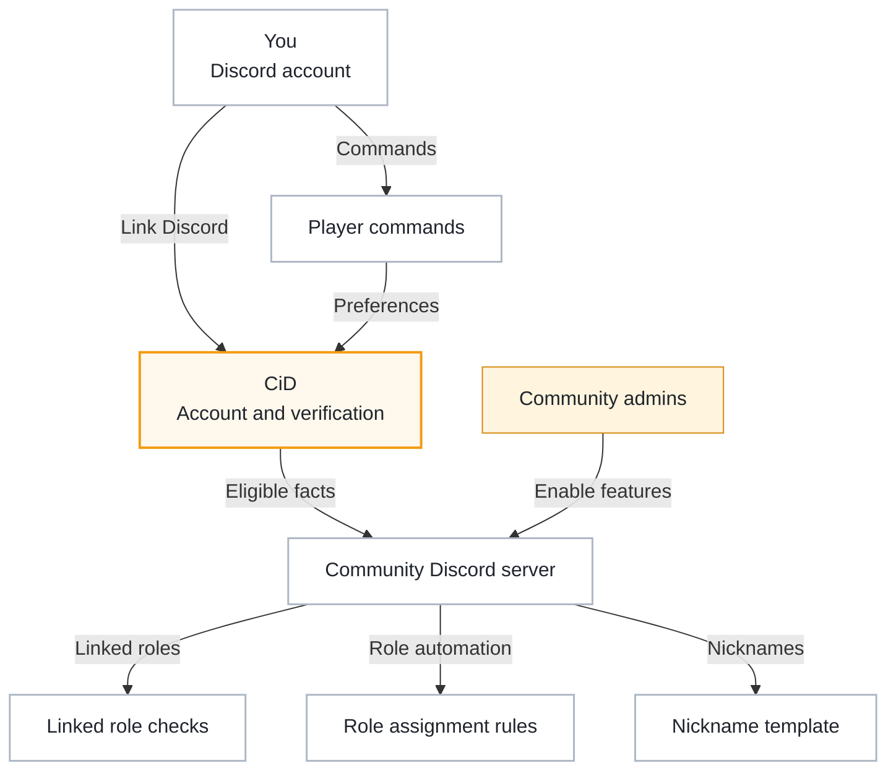

# Discord Integrations

Citizen iD can connect your player identity to Discord servers that choose to use it.
The important phrase is <strong>choose to use it</strong>.
Citizen iD does not automatically manage every Discord server you join.
A server owner or community admin must configure the Citizen iD bot, Discord linked roles, role assignment templates, nickname management, or another integration.

Different servers may use different parts of the platform.
For example:

- One server may only let you claim Discord linked roles.
- Another server may automatically assign roles when you join.
- Another server may update your server nickname based on Citizen iD and RSI data.
- Another community may pair Discord automation with an external application that requests Citizen iD claims.

**Diagram: Discord integration map.**
CiD connects your Discord account to the server features a community chooses to enable.

Read the three server branches as optional features.
A community can enable one feature, several features, or none of those features.
The player-command path is separate because commands are actions you trigger, while linked roles, role assignments, and nickname templates are server features configured by admins.

## Shared Data

Discord integrations use only the information needed for the configured feature.
Typical data can include:

- Whether your Discord account is linked.
- Whether your Citizen iD account exists.
- Whether RSI verification is complete.
- Selected public RSI profile facts.
- Public discovery state.
- Community-specific role or nickname preferences.

The exact data depends on the server configuration and the feature being used.
Citizen iD does not give every Discord server unlimited account access just because you linked Discord.

::: tip Data boundary
Discord integration facts are not the same thing as an external application authorization.
External applications use OAuth consent.
Discord server automation uses the community's configured Discord integration features.
:::

## Linked Roles

Discord linked roles are claimed from Discord's own role interface.
The normal linked-role flow is:

1. Open Discord's linked role interface.
2. Choose the role that uses Citizen iD.
3. Let Discord send you through Citizen iD.
4. Sign in or confirm your existing Citizen iD session.
5. Let Citizen iD update the role metadata Discord needs.
6. Return to Discord and claim the role.

If your account is not RSI-verified, Citizen iD can warn you that the linked role may still be unavailable.

Linked roles are often the most visible Discord feature because the claim action happens in Discord.
They are not the only role feature Citizen iD supports.

## Role Assignments

Some servers use Citizen iD role assignments.
Role assignments are configured by community admins and can change your Discord server roles automatically.
They may run when:

- You join a server.
- Your linked accounts change.
- RSI profile data changes.
- A role-sync event is triggered.
- Someone uses a manual resync command.

A role assignment can depend on:

- Citizen iD account state.
- Discord state.
- Public profile settings.
- RSI profile data.
- RSI profile details.
- RSI organization membership.

The exact rules are chosen by the community.
If you do not understand why a role was added or removed, ask that community's admins which Citizen iD role-assignment templates they use.

## Nickname Management

Some servers use Citizen iD nickname management.
Nickname management can set or update your server nickname from a configured template.
The template may use:

- Your Citizen iD display name.
- Your server-local display-name preference.
- RSI information.
- Other fields selected by the server.

Discord still controls final nickname limits and permissions.
If the bot cannot manage your nickname, the cause is often one of these Discord-side constraints:

- The bot role is too low in the Discord role hierarchy.
- The bot is missing nickname-management permission.
- The nickname cannot be represented within Discord's limits.

## Player Commands

The Citizen iD Discord bot includes player-facing account commands.
Depending on server configuration, you may be able to:

- Prompt account creation.
- Set a global Citizen iD display name.
- Set a server-specific display-name preference.
- Remove display-name preferences.

Commands can be rate-limited.
Some command responses are private to you.
Some admin-triggered prompts may mention another server member.

## Opt Out

The simplest way to opt out of a server's role or nickname automation is to leave that Discord server.
You can unlink Discord from Citizen iD where supported, but that may affect sign-in and other servers.
If Discord is your last supported sign-in method, link another provider first.

Revoking an external application does not necessarily disable Discord server automation, because those are different integration paths.

::: details Details for role or nickname disputes

Citizen iD can provide the automation layer, but the community chooses the rules.

For a role or nickname dispute, collect:

- The server name.
- The affected role or nickname.
- The approximate UTC time.
- Whether you recently changed RSI data.
- Whether you recently changed linked-account data.
- Whether a manual resync was attempted.

Do not post private tokens or account exports in a Discord support channel.

:::
