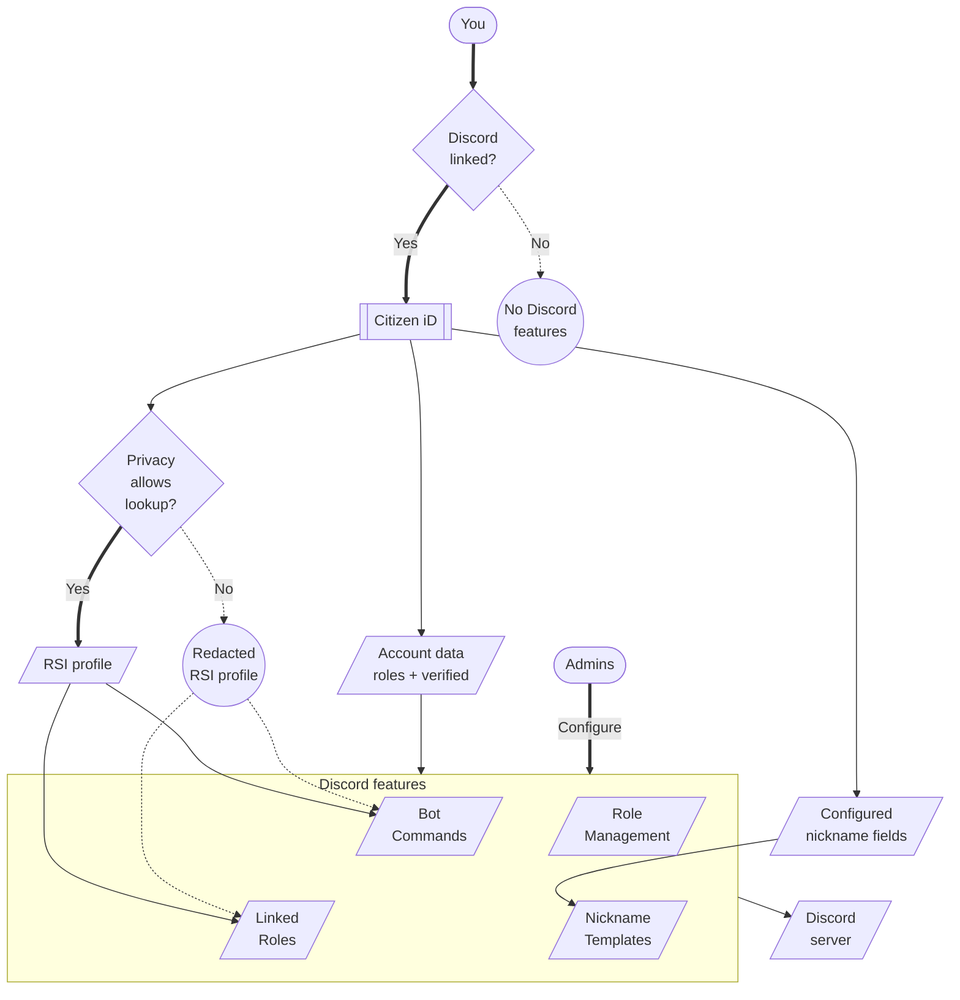

# Discord Integrations

Citizen iD can connect your player identity to Discord servers that choose to use it.
The important phrase is <strong>choose to use it</strong>.
Citizen iD does not automatically manage every Discord server you join.
A server owner or community admin must configure the Citizen iD bot, Discord linked roles, role assignment templates, nickname management, or another integration.

All community Discord integration features expect your Citizen iD account to be [linked to a Discord account](/players/linked-accounts).
If Discord is not linked, the bot cannot reliably identify your Citizen iD account from Discord, linked roles cannot evaluate the expected account conditions, and server automation cannot apply account-aware rules to you.

Different servers may use different parts of the platform.
For example:

- One server may only let you claim Discord linked roles.
- Another server may automatically assign roles when you join or when account facts change.
- Another server may update your server nickname from a Citizen iD nickname template.
- Another server may let members use public RSI lookup commands through the Citizen iD bot.
- Another community may pair Discord automation with a third-party application that requests Citizen iD claims.

**Diagram: Discord integration map.**
Citizen iD connects your linked Discord account to the server features a community chooses to enable.

Read the diagram as a data-flow map.
The Discord link decides whether any account-aware Discord feature can use Citizen iD for your Discord account.
Once Discord is linked, basic account data such as roles and verified state can feed configured Discord features even when detailed RSI lookup is private.
The external lookup setting is the privacy gate for detailed RSI profile lookups and other privacy-aware surfaces.
Nickname template preview and resolution are separate and do not consult public-discovery or privacy settings.
Configured nickname fields flow to nickname templates independently of the privacy-aware lookup branch.
The Roles feature group includes linked roles and automated role management.
Community admins configure the feature group, and server members reach Citizen iD through bot commands where the bot is present.

## Shared Data {#shared-data}

This section explains the public Discord verification state and [detailed lookup](#detailed-lookup) behavior.

When your Citizen iD account is linked to a Discord account, any Discord server may publicly learn whether that Discord account is tied to a verified RSI account.
This public result is only a yes-or-no verified-state check.
It does not reveal your RSI handle, RSI profile details, organization memberships, Citizen iD roles, authorized applications, email, or other account data by itself.

This verified-state check applies regardless of your Citizen iD privacy settings.
The only way to prevent Discord from being used for that public verified-state check is to unlink the Discord provider from your Citizen iD account and use a different sign-in method.
If Discord is your only sign-in provider, link another provider such as Google or Twitch before unlinking Discord.

::: warning Discord link boundary
Privacy settings can limit profile lookup and public profile discovery, but they do not hide the fact that a linked Discord account is or is not tied to a verified RSI account.
Treat Discord linking as publicly visible verification context.
:::

### Detailed Lookup {#detailed-lookup}

Discord integrations can also use more information when a community configures deeper automation.
The exact data depends on the server feature and on your discovery settings, but the important split is:

- A linked Discord account can expose the yes-or-no RSI verified-state check.
- A configured server feature can evaluate general Citizen iD account facts needed for that feature.
- Detailed RSI profile lookup and advanced RSI-based conditions depend on external account lookup being allowed.

::: tip Data boundary
Discord integration facts are not the same thing as a third-party application authorization.
Third-party applications use OAuth consent.
Discord server automation uses the community's configured Discord integration features.
:::

## Linked Roles {#linked-roles}

Discord linked roles must be enabled by server admins.
Admins configure dedicated Discord roles that are linked to Citizen iD account conditions.
Players must then explicitly claim those roles through Discord's own role dialogs.
This section covers how to [claim roles](#claim-roles) and how [removing roles](#removing-roles) works after a role is on your Discord server profile.

### Claim Roles {#claim-roles}

The normal linked-role flow is:

1. Open Discord's linked role interface.
2. Choose the role that uses Citizen iD.
3. Let Discord send you through Citizen iD.
4. Sign in or confirm your existing Citizen iD session.
5. Let Citizen iD update the role metadata Discord needs.
6. Return to Discord and claim the role.

Linked-role details can appear on server profiles for the corresponding Discord members.
If privacy settings disallow external account lookup, Discord can show `<REDACTED> (profile not public)` instead of the actual RSI handle.
The linked-role surface can still show that the account is active or RSI-verified when that is one of the configured linked-role conditions.

<ImageFigure
  src="/images/discord-linked-role-profile-preview.png"
  alt="Discord server profile app section showing Citizen iD linked-role details including account active, RSI profile verified, and RSI registration date."
  title="Linked role preview"
  caption="Shows how Citizen iD linked-role details can appear on a Discord server profile."
  description="When external account lookup is not allowed, profile fields such as the RSI handle can be redacted while linked-role condition badges can still appear."
/>

Linked roles are often the most visible Discord feature because the claim action happens in Discord.
They are not the only role feature Citizen iD supports.

<ImageStepper
  title="Existing Discord linked role claim screens"
  note="These images are placeholders from an older Discord linked-role flow and should be replaced with current Discord screenshots when available."
  :items="[
    {
      src: '/images/discord_full-server-menu-roles.png',
      alt: 'Discord server menu with the Linked Roles entry visible.',
      title: 'Open linked roles',
      caption: 'Shows where a player starts from Discord when claiming a server role connected to Citizen iD.',
      description: 'The exact Discord menu can vary by client, but the important step is that the player begins from Discord and chooses the server role interface.'
    },
    {
      src: '/images/discord_full-linkedroles-select.png',
      alt: 'Discord linked role selection dialog showing roles available in a server.',
      title: 'Choose a role',
      caption: 'Shows the Discord role selection step before Citizen iD receives the linked-role request.',
      description: 'Discord controls this surface, while Citizen iD supplies the metadata Discord needs to decide whether the role can be claimed.'
    },
    {
      src: '/images/discord-linkedroles-authorize.png',
      alt: 'Discord connection dialog asking the player to connect Citizen iD for a linked role.',
      title: 'Connect account',
      caption: 'Shows the Discord-side connection prompt that appears when the role needs Citizen iD metadata.',
      description: 'This step belongs to Discord, but it prepares the handoff to Citizen iD so the account requirement can be checked.'
    },
    {
      src: '/images/discord-linkedroles-authorize-redirect.png',
      alt: 'Discord leaving-site confirmation dialog for visiting the Citizen iD linked roles URL.',
      title: 'Visit Citizen iD',
      caption: 'Shows Discord warning that the flow is leaving Discord and opening Citizen iD.',
      description: 'Continue only when the destination is the expected Citizen iD site for the environment you are using.'
    },
    {
      src: '/images/discord_full-linkedroles-claim.png',
      alt: 'Discord linked role claim screen showing a Citizen iD-connected role requirement.',
      title: 'Claim role',
      caption: 'Shows the final Discord-side claim step after the Citizen iD-linked requirement is available.',
      description: 'If the requirement is not satisfied, return to Citizen iD to finish the missing account setup, such as linking Discord or completing RSI verification.'
    }
  ]"
/>

### Removing Roles {#removing-roles}

Linked roles can be removed from a member's Discord server profile by that member.
Server admins cannot individually remove a linked role claim from one member's server profile through Citizen iD.
Admins can change the linked-role configuration for the server, but an already claimed linked role is removed from the member side in Discord.

## Role Management {#role-management}

Some servers use automated Citizen iD role management.
Role management is configured by community admins and can change your Citizen iD community roles or Discord server roles automatically.
This section covers [automation triggers](#automation-triggers) and [advanced conditions](#advanced-conditions) that a community may configure.

### Automation Triggers {#automation-triggers}

It may run when:

- You join a server.
- Your linked accounts change.
- RSI profile data changes.
- A role-sync event is triggered.
- Someone uses a manual resync command.

Automated role management can access general information about the Citizen iD account linked to the corresponding Discord account regardless of privacy settings.
That general information can include:

- Citizen iD system roles.
- Some community-scoped roles.
- Discord server roles that you have on the designated community server.
- Current profile accessibility: Public, Public without external account lookup, or Private.

Communities can use that information to conditionally assign Citizen iD community roles, Discord server roles, or both.
Privacy settings do not block this general automation data when the feature is running in a server where your linked Discord account is present.

When external account lookup is allowed on your account, server admins may also configure advanced conditions based on public RSI profile information.

### Advanced Conditions {#advanced-conditions}

Advanced conditions can filter by:

- Concrete individual RSI profiles.
  - RSI profile age.
- Public organization memberships.
  - Membership in concrete organizations.
  - Concrete ranks, membership types, or organization roles.

The exact rules are chosen by the community.
Community admins can review [role assignment setup](/community-admins/role-assignments) when the issue depends on configured templates.
If you do not understand why a role was added or removed, ask that community's admins which Citizen iD role-management templates they use.

## Nickname Management {#nickname-management}

Some servers use Citizen iD nickname management.
Nickname management can set or update your server nickname from a configured template.
Server admins choose the template.
This section covers [template formats](#template-formats) and [Discord limits](#discord-limits) that can prevent nickname changes.

### Template Formats {#template-formats}

Templates can enforce formats such as:

- `<YOUR_DISPLAY_NAME> (<YOUR_RSI_HANDLE>)`
- `<YOUR_RSI_HANDLE>`
- A custom format chosen by the community.

Some templates include a customizable display-name segment.
Use `/account set-display-name server-display-name:<YOUR_DISPLAY_NAME>` in any Discord server where the Citizen iD integration bot is present to configure your preferred display name for that server.
Use `/account unset-display-name server-display-name:true` to remove the server preference.
After removal, the result follows the community's configured template fallback.
For **Preferred Display Name (Guild/Account)**, Citizen iD uses the server preference, then Citizen iD account display name, then global Discord display name, then Discord username.

Nickname template preview and resolution do not consult public-discovery or privacy settings.
Server admins choose the template, and configured linked Citizen iD, RSI, or organization values can become visible in your Discord nickname.
Missing or null fields and their formatting are omitted.
If every selected value is null, or no fields are configured, composition uses your global Discord display name when present, otherwise your Discord username.
During live sync, that fallback may leave an existing custom server nickname unchanged instead of clearing it.

Discord still controls final nickname limits and permissions.
Community admins can review [nickname management setup](/community-admins/nickname-management) when the issue depends on server configuration.

### Discord Limits {#discord-limits}

If the bot cannot manage your nickname, the cause is often one of these Discord-side constraints:

- The bot role is too low in the Discord role hierarchy.
- The bot is missing nickname-management permission.
- The nickname cannot be represented within Discord's limits.

## Player Commands {#player-commands}

The Citizen iD Discord bot includes player-facing account and RSI commands.
Depending on server configuration, you may be able to:

- Prompt account creation.
- Set a global Citizen iD display name.
- Set a server-specific display-name preference.
- Remove display-name preferences.
- Request public RSI profile information.
This section covers [account commands](#account-commands) and [lookup commands](#lookup-commands).

### Account Commands {#account-commands}

Use `/account set-display-name server-display-name:<YOUR_DISPLAY_NAME>` to set the server-preferred display name used by compatible nickname templates.
Use `/account unset-display-name server-display-name:true` to remove that server preference.
The resulting nickname follows the configured template fallback, including server preference, Citizen iD account display name, global Discord display name, then Discord username for **Preferred Display Name (Guild/Account)**.

### Lookup Commands {#lookup-commands}

Members on servers with the Citizen iD integration bot can use `/rsi profile rsi-handle:<RSI_HANDLE>` to request detailed public information about a corresponding RSI profile.
They can also use `/rsi profile server-member:<MEMBER_TAG>` to request the RSI profile tied to a particular Discord user.

The member lookup has important caveats:

- The target user must have a Citizen iD account linked to their Discord account.
- The target user's privacy settings must allow external provider discovery.
- You, the Citizen iD bot, and the target user must share the server where you request the information.

If those conditions are not met, the lookup can fail or return a redacted/not-public result.
Commands can be rate-limited.
Some command responses are private to you.
Some admin-triggered prompts may mention another server member.

## Opt Out {#opt-out}

All community integration features expect a Discord provider link to function properly.
Leaving a server can stop that server from applying its own role or nickname automation to you, but it does not remove the Discord provider link from your Citizen iD account.
Revoking a third-party application also does not disable Discord server automation, because those are different integration paths.

To opt out of Discord-based Citizen iD identification, unlink the Discord provider from your Citizen iD account and use a different sign-in method.
This is also the only way to prevent Discord servers from learning the public yes-or-no verified RSI state tied to your linked Discord account through Citizen iD.
If Discord is your last supported sign-in method, link another provider first.

::: details Details for role or nickname disputes

Citizen iD can provide the automation layer, but the community chooses the rules.

For a role or nickname dispute, collect:

- The server name.
- The affected role or nickname.
- The approximate UTC time.
- Whether you recently changed RSI data.
- Whether you recently changed linked-account data.
- Whether a manual resync was attempted.
- For role or lookup disputes only, whether you recently changed external account lookup or profile discovery settings.

Do not post private tokens or account exports in a Discord support channel.

:::
