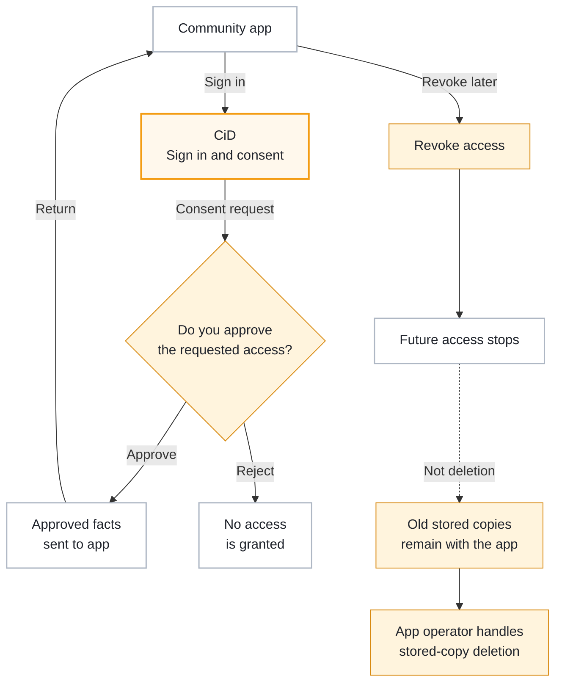

# External Apps

External applications are community tools that use Citizen iD for sign-in, account linking, or API access.
They can include:

- Websites.
- Overlays.
- Dashboards.
- Discord-adjacent tools.
- Operations tools.
- Other Star Citizen community software.

Citizen iD is the identity provider in these flows.
The external application is still operated by its own community or developer.

That distinction matters because Citizen iD can control what it sends going forward, but it does not control every database where an application stores data after receiving it.

**Diagram: App sign-in and consent.**
The important player choice happens at the consent screen before CiD sends approved information back to the application.

Read the approval and rejection branches as the decision point in the consent screen.
Approval lets CiD send only the approved facts back to the app, while rejection ends the authorization without granting access.
The later revocation branch explains a different action: it stops future CiD access, but it does not erase copies an app already stored.

## Sign In Flow

When an application needs Citizen iD identity, it redirects you to Citizen iD.
The normal authorization flow is:

1. The external application redirects you to Citizen iD.
2. Citizen iD signs you in or uses your existing session.
3. Citizen iD shows a consent screen if the requested access requires consent.
4. You approve or reject the request.
5. Citizen iD redirects you back to the application with the authorization result.

If something is missing, such as required email or RSI profile data, Citizen iD can stop the flow and tell you which requirement must be satisfied first.

## Consent Screen

The consent screen is where you decide whether a specific application may receive selected data.
Before approving, review:

- The application name.
- The community or operator you expect to be using.
- The requested permissions.
- Whether the application is asking for continuing access.
- Whether the request includes profile data, email, roles, provider profile data, RSI profile data, RSI organization data, or public role information.

If a request does not make sense for what you are trying to do, stop and ask the application operator why it is needed.
Approving consent should be an informed choice, not a reflexive button click.

## Scopes and Claims

Applications request scopes.
Scopes describe categories of access, such as profile information, email, roles, provider data, RSI profile data, RSI organization data, or offline access.
Claims are the values that can appear in tokens or userinfo responses after access is approved.

A claim might identify:

- Your Citizen iD account.
- Your preferred username.
- Your display name.
- Your email.
- Your roles.
- Your RSI username.
- Your RSI organization membership.
- Other approved facts.

Not every requested scope always produces data.
If optional data is missing, Citizen iD can omit it.
If required data is missing, authorization can block until you provide it.

::: info Required scopes
A required scope means the application says that data is necessary for the flow.
For example, an application that requires verified RSI data can block sign-in until RSI verification is complete.
:::

## Revoke Access

Use revocation when you no longer want an application to continue using its Citizen iD authorization.

1. Open the authorized apps area of your Citizen iD account.
2. Review the applications connected to your account.
3. Open the application's authorization details.
4. Check the granted permissions.
5. Use <strong>Revoke Authorization</strong>.
6. Reauthorize later only if you intentionally want the application to use Citizen iD again.

## Retained Data

Revocation stops future access through Citizen iD.
It does not automatically delete data the application already received while authorized.

If the application stored a copy of your profile, roles, RSI data, or email while access was valid, contact the application or community operator for deletion, correction, or export requests about that copy.
This is the same practical boundary that exists with many sign-in providers: revoking future access does not reach into every third-party system and erase historical records by itself.

## Safer Habits

Use these habits for community tools:

- Approve only applications you recognize.
- Prefer the minimum access needed for the task.
- Review authorized apps periodically.
- Revoke old authorizations when you stop using a community tool.
- Be suspicious of applications that ask for broad access without explaining why.

::: details Details for debugging app sign-in

When an external application sign-in fails, record:

- The application name.
- The environment, if you know it.
- The requested action.
- The approximate UTC time.
- The non-secret error message.

If a consent screen says data is missing, fix the missing Citizen iD account state first, such as linking email, linking Discord, or completing RSI verification.

Do not share access tokens, authorization codes, refresh tokens, client secrets, or full callback URLs in public.

:::
