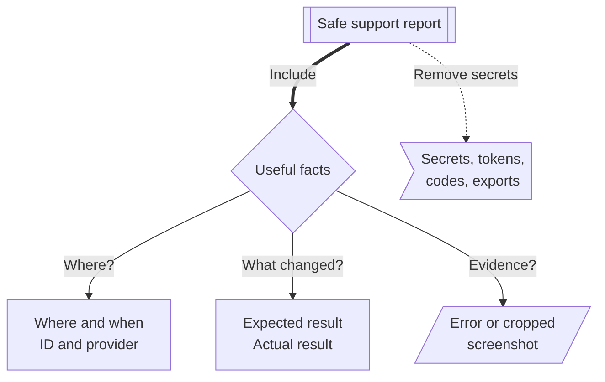

# Getting Help

Support works best when your report is specific, safe to share, and tied to the surface where the problem happened.
A sign-in issue, Discord role issue, RSI verification issue, external application issue, and data export issue need different evidence.
This page helps you collect that evidence before asking for help.

Never post access tokens, refresh tokens, authorization codes, client secrets, password reset links, private account exports, or full private screenshots in public channels.

**Diagram: Safe support report.**
Collect facts that help support reproduce the issue, and remove anything private before sharing.

Read the branches as the four parts of a safe report.
The first three branches are information support can use.
The warning branch is information to remove before sharing, especially in public channels.

## Basic Evidence

Every useful support report should include:

- The affected Citizen iD page, community tool, or Discord server.
- The UTC time when the problem happened.
- The request ID from the error page when one is shown.
- The provider involved, such as Discord, Google, Twitch, RSI, or Citizen iD.
- What you expected to happen.
- What happened instead.
- Whether retrying changed anything, if the issue is intermittent.

## Account Issues

For account-level issues, include the detail that matches the failing flow:

- For sign-in or sign-up problems, say which provider you used and whether you were starting from Citizen iD directly or returning from an external application.
- For linked-account problems, say which provider you tried to link or unlink and whether it is your last sign-in provider.
- For RSI verification problems, include the RSI username you entered and the exact error message.

Do not post private RSI account pages or credentials in public.

## Discord Issues

For Discord issues, include the detail that matches the failing feature:

- For linked-role issues, include the Discord server, the role you tried to claim, and whether Citizen iD showed a success or warning message.
- For role assignment issues, include whether you recently joined the server, changed linked accounts, changed RSI profile data, changed privacy settings, or asked for a manual resync.
- For nickname issues, include the nickname that appeared, the nickname you expected, and whether you changed Citizen iD display-name preferences.

Remember that community admins control the role and nickname templates for their server.
Citizen iD support may need the community admin to check audit logs or bot permissions.

## App Issues

For external application issues, include the application name, requested action, and non-secret error message.
If the consent screen appeared, describe the scopes or requirement it mentioned.

Do not share:

- Access tokens.
- Authorization codes.
- Refresh tokens.
- Full callback URLs if they contain sensitive parameters.
- Client secrets.

If the application already received your data, contact the application operator for deletion or correction requests about that stored copy.

## Privacy Issues

For privacy or data issues, include the detail that matches the request:

- For public profile or discovery issues, include which discovery switches are enabled.
- For authorized app issues, include whether the application is still listed in authorized apps.
- For data export issues, include when you requested the export and whether you may have hit the rate limit.
- For account removal requests, explain whether you need Citizen iD account removal only or also help identifying third-party operators.

## Safe Screenshots

Screenshots can help, but remove sensitive information first.
Hide:

- Tokens.
- Authorization codes.
- Email addresses.
- Private account IDs.
- Private Discord messages.
- Any unrelated user information.

When possible, capture only the error message, request ID, page title, and visible non-secret state.
If support needs sensitive information, move to the official private support path before sharing it.
