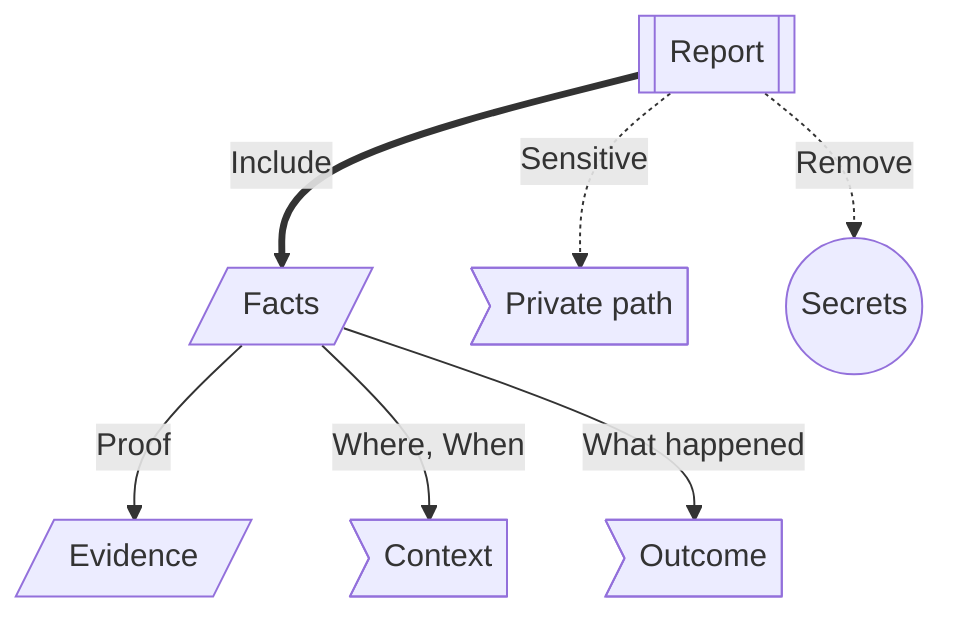

# Getting Help

Support works best when your report is specific, safe to share, and tied to the surface where the problem happened.
First identify whether the issue appeared on the Citizen iD website, in Discord, in an RSI verification step, in a third-party application, or in a privacy or data request.
A sign-in issue, Discord role issue, RSI verification issue, third-party application issue, and data export issue need different evidence.
This page helps you collect that evidence before asking for help.

Use public support only for general questions and non-sensitive troubleshooting.
Use private support when the issue involves account ownership, account removal, security, private screenshots, data exports, or identifiers you would not want copied into a public channel.

Never post access tokens, refresh tokens, authorization codes, client secrets, password reset links, private account exports, or full private screenshots in public channels.

**Diagram: Safe support report.**
Start with the surface where the issue appeared, then collect safe facts and remove private material before sharing.

Read the diagram as a report-preparation map.
Collect useful facts, add only cropped or redacted evidence, choose private support for sensitive account issues, and remove blocked material before sharing.
The blocked node is material to remove before sharing, especially in public channels.

## Where To Ask {#where-to-ask}

Use the [official community Discord](https://discord.citizenid.space) for normal player help.
Use the private support path, such as [`#support-and-contact`](https://discord.com/channels/1401938319843004416/1401942231707029505), when the issue needs private identifiers, account review, deletion review, or sensitive screenshots.
Use [sensitive issues](#sensitive-issues) to decide when the private path is needed from the start.

Ask the third-party application operator when the problem is inside an application after Citizen iD already returned you to it.
Ask the community's Discord admins when the problem depends on server role rules, nickname templates, bot permissions, or server-local audit logs.
Citizen iD support can still help identify which boundary applies when you are unsure.

### Sensitive Issues {#sensitive-issues}

Use private support for suspected account takeover, an unknown authorized app, the wrong RSI account on your Citizen iD account, account deletion, or anything that requires private proof.
In a public channel, keep the message high level and ask for the private path.

Do not post:

- Full account exports.
- Full private screenshots.
- Raw browser console logs if they include tokens, codes, cookies, or private URLs.
- Provider account credentials.
- Password reset links or email verification links.

## Safe Evidence {#safe-evidence}

Before sending support information, collect [basic evidence](#basic-evidence), prepare [safe screenshots](#safe-screenshots), and add [privacy and data](#privacy-and-data) context when the request involves exports, deletion, discovery, or app access.

### Basic Evidence {#basic-evidence}

Every useful support report should include:

- A short summary of the issue.
- The affected Citizen iD page, community tool, or Discord server.
- The exact action you were taking when the problem happened.
- The UTC time when the problem happened.
- The request ID from the error page when one is shown.
- The provider involved, such as Discord, Google, Twitch, RSI, or Citizen iD.
- What you expected to happen.
- What happened instead.
- The exact non-secret error message.
- What you already tried, such as refreshing, retrying later, signing out and back in, or using a different browser.
- Whether retrying changed anything, if the issue is intermittent.
- Whether the issue started after a recent account, Discord, privacy, app, or RSI profile change.

If you need a cross-audience checklist, see [Support Evidence](/reference/support-evidence).

### Safe Screenshots {#safe-screenshots}

Screenshots can help, but remove sensitive information first.
Hide:

- Tokens.
- Authorization codes.
- Email addresses.
- Private account IDs.
- Private Discord messages.
- Any unrelated user information.

When possible, capture only the error message, request ID, page title, and visible non-secret state.
If support needs sensitive information, move to the official private support path before sharing it.

### Privacy And Data {#privacy-and-data}

For [privacy](/players/privacy-controls) or [data issues](/players/data-rights), include the detail that matches the request:

- For public profile or discovery issues, include which discovery switches are enabled.
- For authorized app issues, include whether the application is still listed in authorized apps and whether you already revoked it.
- For data export issues, include when you requested the export and whether you may have hit the rate limit.
- For account removal requests, explain whether you need Citizen iD account removal only or also help identifying third-party operators.

Do not upload a full data export to a public channel.
For deletion, account removal, or ownership review, use private support from the start.

## Issue Details {#issue-details}

Different issue types need different facts.
Use [account issues](#account-issues), [Discord issues](#discord-issues), or [app issues](#app-issues) depending on where the problem appeared.

### Account Issues {#account-issues}

For account-level issues, include the detail that matches the failing flow:

- For [sign-in or sign-up problems](/players/website-basics), say which provider you used, which entry point you started from, and whether you were returning from a third-party application.
- For unexpected account problems, describe the account you expected to open and the visible non-secret account state you actually saw.
- For [linked-account problems](/players/linked-accounts), say which provider you tried to link or unlink, whether it is your last sign-in provider, and the exact blocking message.
- For [RSI verification problems](/players/rsi-verification), include the RSI username you entered, which step failed, whether you saved the public RSI profile field, and the exact error message.

Do not post private RSI account pages or credentials in public.

### Discord Issues {#discord-issues}

For [Discord issues](/players/discord-integrations), include the detail that matches the failing feature:

- For linked-role issues, include the Discord server, the role you tried to claim, and whether Citizen iD showed a success or warning message.
- For role assignment issues, include whether you recently joined the server, changed linked accounts, changed RSI profile data, changed privacy settings, or asked for a manual resync.
- For nickname issues, include the nickname that appeared, the nickname you expected, and whether you changed Citizen iD display-name preferences.
- For bot command or profile lookup issues, include the server, command name, target account if it is safe to name, and whether public profile discovery or external account discovery is enabled.

Remember that community admins control the role and nickname templates for their server.
Citizen iD support may need the community admin to check audit logs or bot permissions.

### App Issues {#app-issues}

For [third-party application issues](/players/third-party-apps), include the application name, community or operator name, requested action, and non-secret error message.
If the consent screen appeared, describe the scopes or requirement it mentioned.
If the browser returned to the application, say whether the application then showed success, a missing-data message, or an error.

Do not share:

- Access tokens.
- Authorization codes.
- Refresh tokens.
- Full callback URLs if they contain sensitive parameters.
- Client secrets.

If the application already received your data, contact the application operator for deletion or correction requests about that stored copy.
