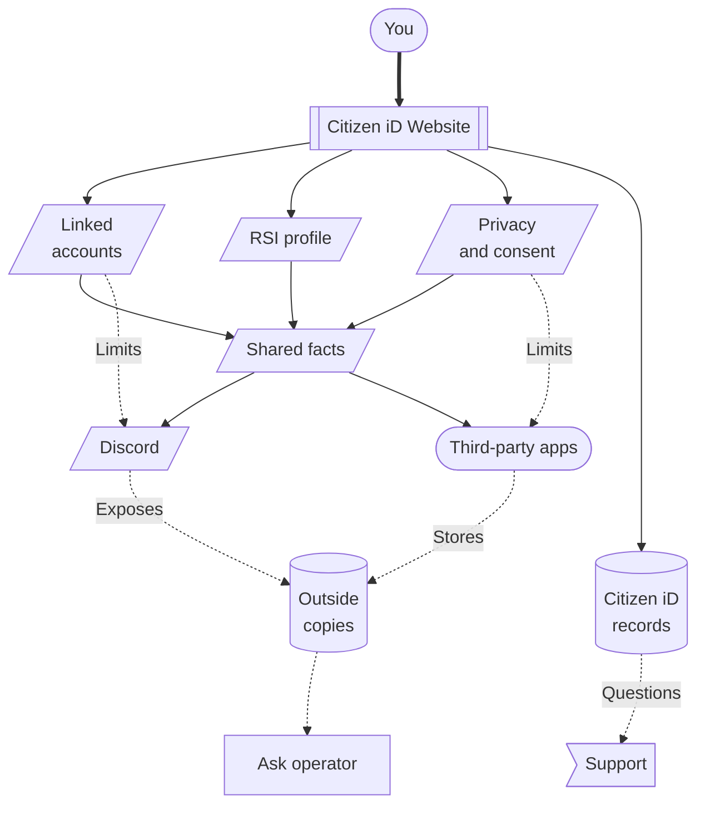

# Player Guide

Citizen iD helps Star Citizen players use one account across community websites, Discord servers, and community tools.
Use this guide when you want to sign in, prove control of your RSI account, connect Discord features, approve an application, change privacy settings, download your data, or ask for help safely.

The player docs are organized around the place where your question starts.
If the issue starts on the Citizen iD website, begin with website and account pages.
If it starts in Discord, begin with Discord integrations.
If it starts in a community tool, begin with third-party apps and consent.
If it starts with visibility, exports, deletion, or support, begin with the privacy, data, or help pages.

**Diagram: Player identity map.**
This is a relationship map, not a checklist.
It shows the main places where your account, linked accounts, verified status, privacy choices, shared facts, outside copies, and support questions meet.

The clickable diagram nodes are only shortcuts.
Use the ordinary links below when you prefer a regular page list.

## Choose A Page

- [Website Basics](/players/website-basics) covers sign-up, sign-in, account overview, account settings, first setup, third-party redirects, and maintenance states.
- [Linked Accounts](/players/linked-accounts) covers Discord, Google, Twitch, email, RSI-related links, unlinking, last sign-in provider warnings, and what changes after a provider is removed.
- [RSI Verification](/players/rsi-verification) covers the Star Citizen account-control check, the RSI Short Bio verification string, verified status, failed checks, and daily public profile refresh.
- [Discord Integrations](/players/discord-integrations) covers Discord linked roles, role automation, nickname templates, player commands, public verified-state checks, and the limits of privacy settings inside Discord features.
- [Third-Party Apps](/players/third-party-apps) covers community-operated web, desktop, or mobile apps, sign-in redirects, consent screens, requested information, required account data, revocation, and app-held copies.
- [Privacy Controls](/players/privacy-controls) covers public profile discovery, linked-account discovery, authorized applications, browser analytics preferences, and how those controls differ from each other.
- [Data Rights](/players/data-rights) covers data exports, account removal requests, records that may remain, third-party copies, and who controls each kind of data.
- [Getting Help](/players/getting-help) covers safe support reports, where to ask, what evidence to include, and what private material to remove before sharing.

## First Choices

Start with the surface where you are taking the action.

- Use the [Citizen iD website](/players/website-basics) when you need to create or open an account, check account state, change settings, manage linked providers, review authorized apps, or request an export.
- Use [RSI verification](/players/rsi-verification) when a community asks for a verified Star Citizen identity or when a tool says verified RSI status is required.
- Use [Discord integrations](/players/discord-integrations) when the visible result is a Discord role, nickname, linked-role badge, bot command, or server-specific lookup.
- Use [third-party apps](/players/third-party-apps) when another website, desktop app, mobile app, or community tool sends you to Citizen iD for sign-in or consent.
- Use [privacy controls](/players/privacy-controls) when the question is about who can find your public profile, which app can keep using approved information, or whether this browser sends optional analytics.
- Use [data rights](/players/data-rights) when the question is about downloading Citizen iD data, asking for account removal, or understanding data stored outside Citizen iD.
- Use [getting help](/players/getting-help) when something is blocked, confusing, or sensitive enough that you need support evidence before posting.

::: tip A simple way to debug
Ask where the action happened first.
The Citizen iD website, Discord, an RSI profile page, a third-party app, and a support request each have different controls and different owners.
:::

## Core Ideas

Citizen iD is not a government identity service, payment service, age check, reputation system, or promise that every community has configured its tools correctly.
It is a player identity service for Star Citizen communities.

Several account facts can work together without being the same thing.

- A sign-in provider lets you open the Citizen iD account.
- A linked Discord account lets Discord features match your Discord user to your Citizen iD account.
- RSI verification proves control of one RSI account and can become stable verified status for communities and apps.
- Public discovery settings affect lookup and public profile visibility through Citizen iD.
- Application consent lets a specific app receive approved information even when public discovery is limited.
- Revocation stops future access through Citizen iD, but it does not erase data an app or server already stored.
- Data export and account removal apply to records Citizen iD controls, not to every copy held by providers, communities, Discord servers, or third-party apps.

::: warning Controls are separate
Turning off public discovery does not revoke a third-party app.
Revoking an app does not unlink Discord.
Unlinking a provider does not delete old copies stored by an app, provider, Discord server, or community.
Use the page that matches the control you want to change.
:::

## Common Journeys {#common-journeys}

Use these paths for common player tasks: [Account Setup](#account-setup), [Discord Features](#discord-features), [Community Apps](#community-apps), [Visibility And Sharing](#visibility-and-sharing), and [Support Requests](#support-requests).

### Account Setup {#account-setup}

Start with [Website Basics](/players/website-basics), choose the intended sign-in provider, complete first setup, review privacy choices, link Discord if needed, and verify RSI when your community requires it.

### Discord Features {#discord-features}

Use [Linked Accounts](/players/linked-accounts) to confirm Discord is linked, use [RSI Verification](/players/rsi-verification) if verified status is required, and use [Discord Integrations](/players/discord-integrations) for roles, nicknames, and commands.

### Community Apps {#community-apps}

Use [Third-Party Apps](/players/third-party-apps) to understand sign-in and consent, then use [Privacy Controls](/players/privacy-controls) when you want to review or revoke saved app access.

### Visibility And Sharing {#visibility-and-sharing}

Use [Privacy Controls](/players/privacy-controls) for public discovery, app authorization, and browser analytics, then use [Data Rights](/players/data-rights) when the question is about exports, removal, or copies outside Citizen iD.

### Support Requests {#support-requests}

Use [Getting Help](/players/getting-help) before posting screenshots, exports, request details, or account identifiers.

## Important Boundaries

RSI verification proves control of an RSI account when Citizen iD can verify it.
It does not prove real-world identity, legal status, trustworthiness, account value, or player reputation.

Discord server roles and nicknames reflect the rules chosen by that server or community.
Citizen iD can evaluate and apply configured rules, but it does not decide what every server should grant you.

Third-party apps are operated outside Citizen iD.
Citizen iD can stop future access after you revoke authorization, but it cannot guarantee deletion from an app database that it does not control.

::: warning When something looks wrong
Do not assume every unexpected role, nickname, blocked app, missing profile, or failed sign-in means your Citizen iD account is broken.
First identify whether the behavior comes from Citizen iD account state, a linked provider, RSI verification, Discord server configuration, third-party app consent, privacy settings, or a temporary maintenance or rate-limit condition.
:::

## Related Reference

- [Support Evidence](/reference/support-evidence) is the cross-audience checklist for collecting useful, non-secret support details.
- [Legal And Privacy](/reference/legal-and-privacy) points to broader privacy, legal, and data-rights documentation.
