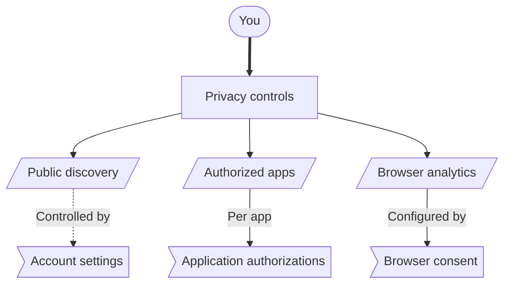

# Privacy Controls

Citizen iD privacy controls answer three different questions.
Who can find your public profile?
Which applications can use information you approved?
Can this browser send optional analytics for the Citizen iD website?

These controls are helpful, but they are not a magic eraser.
They do not delete [copies of information](/players/data-rights#third-party-copies) already held by Discord, RSI/Spectrum, Google, Twitch, a community server, or a third-party application.

## Quick Map {#quick-map}

Use the control that matches the thing you want to change.
The map points to the main controls, and [control locations](#control-locations) lists where each one appears.

**Diagram: Where privacy controls live.**
Each branch answers a different privacy question and points you to the matching control.

Changing one of these controls does not automatically change the others.
For example, hiding public profile discovery does not cancel an app access you already authorized.

### Control Locations {#control-locations}

<dl>
  <dt><strong>Public discoverability</strong></dt>
  <dd>Available during initial account setup and later in <a href="https://citizenid.space/account/settings">account settings</a>.</dd>
  <dt><strong>Authorized applications</strong></dt>
  <dd>Available from the account portal home page, where the Applications row shows connected apps and a Manage action.</dd>
  <dt><strong>Browser analytics</strong></dt>
  <dd>Shown on your first website visit and available later through the Privacy Preferences link in the account portal footer.</dd>
</dl>

## Public Discoverability {#public-discoverability}

Public discoverability settings are available immediately after you create your Citizen iD account.
You can also change them at any time in [account settings](https://citizenid.space/account/settings).
This section covers the discovery switches and [public lookup results](#public-lookup-results).

These settings can prevent your RSI account details from being publicly accessible through Citizen iD lookup surfaces.
That includes supported lookups that start from linked external accounts, such as Discord context on shared servers.

Citizen iD currently exposes two main discovery switches.

<dl>
  <dt><strong>Allow public profile discovery</strong></dt>
  <dd>Allows your Citizen iD profile to be found by your Citizen iD account ID or verified RSI handle.</dd>
  <dt><strong>Allow public profile discovery via linked external accounts</strong></dt>
  <dd>Allows supported linked accounts, including Discord, to be used as a way to find your public profile where a feature supports it.</dd>
</dl>

The first switch controls whether your public Citizen iD profile can be found directly.
The second switch controls whether linked accounts can act as lookup paths into that public profile.

Turn public profile discovery off when you do not want public lookup to confirm or show your Citizen iD profile.
Turn linked-account discovery off when you do not want supported provider links, such as Discord, to be used as public lookup handles.

<ImageFigure
  src="/images/citizenid-account-settings-current.png"
  alt="Current Citizen iD account settings page showing public profile discovery controls and the Privacy Preferences footer link."
  title="Account settings"
  caption="Shows where public profile discovery and linked-account discovery can be changed."
  description="Use account settings when you want to control whether your public Citizen iD profile and public RSI details can be found through supported lookup paths."
/>

::: tip Set this early
The discovery choices are available during initial account setup, so you can decide before other people or integrations rely on public lookup.
:::

::: warning Discord visibility is layered
Discovery settings can block detailed public profile and RSI lookup through Citizen iD.
They are not the same as unlinking Discord, and they may not disable every yes-or-no Discord feature that only checks whether a linked account satisfies a server condition.
Use [Discord Integrations](/players/discord-integrations#shared-data) to understand the public Discord verified-state check.
:::

### Public Lookup Results {#public-lookup-results}

When public profile discovery is enabled, public profile pages can show your display name, avatar, and public RSI account data.
Public RSI account data means information Citizen iD can read from public RSI/Spectrum sources and show on the public profile surface.

When discovery is disabled, a lookup can return a not-found or not-public result even when the account exists.
That is intentional.
It prevents the lookup result from confirming private account existence when the profile should not be discoverable.

Public lookup can therefore produce a few different results.

- A public profile appears because discovery is enabled and the profile has public data to show.
- A lookup fails because the profile is not publicly discoverable.
- A lookup finds an account but cannot show details because the relevant visibility setting blocks that surface.

If a Discord or community feature cannot find your public RSI details, check the two discovery switches first.
Also check whether the Discord account is linked to the expected Citizen iD account.

## Application Access {#application-access}

Application consent is separate from public discovery.
An application can receive the information you approved even when your public profile is not discoverable.
That happens because you authorized that specific application through Citizen iD.

Authorized applications and their saved consents are directly accessible from the Citizen iD account portal home page.
Use the Applications row to open the authorized-app list, review each application, and open its details.
The detailed view uses the revoke action to cancel that saved authorization individually.

<ImageFigure
  src="/images/citizenid-account-overview-current.png"
  alt="Current Citizen iD account overview showing an Applications row with an authorized application count and Manage action."
  title="Authorized applications"
  caption="Shows where application consents can be reviewed from the account portal home page."
  description="Open the Applications area to review connected apps, inspect what you approved, and revoke access you no longer want."
/>

Use [Third-Party Apps](/players/third-party-apps) when you want the full walkthrough for app sign-in, consent review, and revocation.

The practical rule is:

- Public discovery controls who can look up public profile surfaces.
- Application consent controls which approved application can receive approved information.
- Revoking authorization stops future application access through Citizen iD.
- Revoking authorization does not automatically delete data an application already received.

::: warning Consent is separate
Turning off public discovery does not revoke an application authorization.
Revoking an application authorization does not change browser analytics consent.
Revoking an application authorization does not necessarily disable Discord server automation.
These controls are related, but they are not interchangeable.
:::

## Analytics Preferences {#analytics-preferences}

Citizen iD asks for browser analytics consent when you first visit the website.
You can accept analytics, reject analytics, or manage preferences from that banner.
You can change the choice later by using the <strong>Privacy Preferences</strong> link in the account portal footer.

Necessary cookies and similar technologies are still used for login, security, OAuth authorization, account sessions, and abuse prevention.
Those are needed for the website and account portal to work.

Optional analytics are different.
With your permission, Citizen iD uses privacy-preserving analytics to understand how the website is used and to improve reliability.
The current notice says those analytics are processed through PostHog EU, retained for up to 3 months, and not used for advertising, retargeting, sale of personal data, or cross-site behavioral tracking.

You can reject analytics and still use Citizen iD.
Analytics consent is stored in your browser, so changing browsers or clearing browser storage can make the banner or preference state appear again.
If your browser sends Do Not Track, Citizen iD may treat that as an analytics rejection.

<ImageFigure
  src="/images/citizenid-analytics-consent-banner.png"
  alt="Citizen iD analytics consent banner with Accept Analytics, Reject Analytics, and Manage Preferences actions."
  title="Analytics consent"
  caption="Shows the browser banner that appears when Citizen iD asks for optional analytics consent."
  description="Use the banner or the Privacy Preferences footer link to choose whether this browser sends optional analytics."
/>

## Which Control {#which-control}

Use these questions to choose the right place.

- Ask <em>who can find my profile or RSI details</em> when changing public discoverability.
- Ask <em>which app can use information I approved</em> when reviewing authorized applications.
- Ask <em>whether this browser can send optional analytics</em> when changing analytics preferences.
- Ask <em>which server configured this automation</em> when Discord roles or nicknames change.
- Ask <em>where is this data stored now</em> when trying to delete or correct old third-party data.
