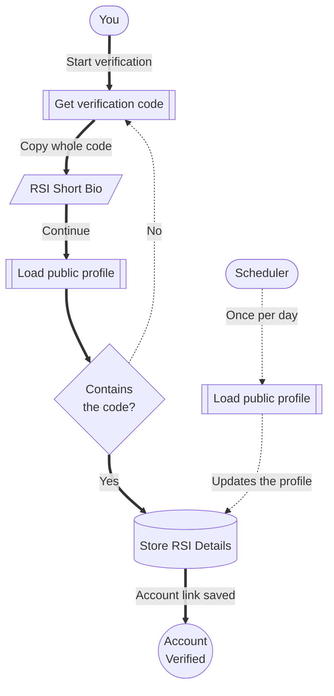

# RSI Verification

RSI verification connects your Citizen iD account to your Star Citizen identity.
It proves that you control a specific RSI account by asking you to place a Citizen iD verification string in a public RSI profile field.
Communities and third-party applications can then rely on Citizen iD verified status instead of making every player repeat a separate RSI bio-change verification for each server, site, or tool.
After verification succeeds, Citizen iD can keep public RSI account details up-to-date, including later handle changes.

**Diagram: RSI verification at a glance.**
You get a verification code from Citizen iD, save it in the public RSI Short Bio, and then receive verified status.
The check and refresh paths explain why you normally only need to do this once.

## Before Starting

Use only an RSI account that you own or control.
Citizen iD expects one Citizen iD account to be linked with one RSI account.
This rule protects communities from duplicate verification, impersonation, and ban-evasion patterns.

Before you begin, check these boundaries:

- Do not verify another person's RSI account.
- Do not verify shared organization accounts.
- Do not create a second Citizen iD account as a workaround.

::: danger One RSI account
RSI verification is intentionally more sensitive than ordinary provider linking.
After an RSI account is verified, it cannot be unlinked or replaced with a different RSI account.
If the verified RSI account is wrong, the Citizen iD account must be closed as a whole.
This is intentional because communities and third-party applications rely on the verified RSI link as a stable account-control signal.
:::

## Verification Steps

Verification is a short handoff between Citizen iD and your public RSI profile.
Citizen iD gives you a generated string, you place that whole string somewhere in the RSI <strong>Short Bio</strong> field, and Citizen iD checks the public profile for the exact same string.

The surrounding text in your bio can stay as it is, but the generated string itself must not be shortened, retyped, split, or reformatted before Citizen iD confirms success.

Use these steps as the practical checklist:

1. Enter the RSI username for your account.
2. Confirm the profile is available and not already linked.
3. Copy the Citizen iD verification string.
4. Paste the whole string into RSI <strong>Short Bio</strong>.
5. Save the RSI profile.
6. Return to Citizen iD and run verification.
7. Remove the string after Citizen iD confirms success.

<ImageStepper
  title="Existing Citizen iD verification screens"
  note="These images are placeholders from the older interface and should be replaced with current production screenshots when available."
  missing="The missing screenshot is the RSI profile settings page with the Short Bio field highlighted."
  :items="[
    {
      src: '/images/citizenid-overview-unverified.png',
      alt: 'Old Citizen iD account overview showing RSI Account status as pending with a Verify Now button.',
      title: 'Pending status',
      caption: 'Shows where the player starts RSI verification from the account overview.',
      description: 'Use this screen to confirm that you are signed in to the expected Citizen iD account before starting verification.'
    },
    {
      src: '/images/citizenid-verify.png',
      alt: 'Old Citizen iD RSI verification screen showing the username entry step.',
      title: 'Verification flow',
      caption: 'Shows the old username step before Citizen iD asks for the profile update.',
      description: 'This placeholder should eventually become the full current flow, including the generated code and the prompt to update RSI Short Bio.'
    },
    {
      src: '/images/citizenid-overview-verified.png',
      alt: 'Old Citizen iD account overview showing RSI Account status as verified.',
      title: 'Verified status',
      caption: 'Shows the account overview after RSI verification succeeds.',
      description: 'After this state appears, the original verification string can be safely removed from the RSI Short Bio.'
    }
  ]"
/>

## Failed Checks

Verification can fail for ordinary reasons.
Common causes include:

- The username is misspelled.
- The RSI profile is temporarily unavailable.
- The profile is already linked to another Citizen iD account.
- The verification string is missing.
- The verification string was changed or placed in the wrong field.
- The RSI profile was not saved publicly yet.

If verification fails:

1. Return to the profile settings step.
2. Confirm the string is still in public Short Bio.
3. Make sure the generated string is unchanged.
4. Leave surrounding text in place if you want.
5. Wait briefly for the public profile to update.
6. Try verification again.

Extra text around the verification string is fine.
Citizen iD only needs to find the exact generated string somewhere in the public Short Bio content.

## Verified Status

Verified status tells Citizen iD and approved integrations that your account has passed the RSI account-control check.
A community or third-party application can use verified status for several kinds of access decisions:

- Granting Discord roles.
- Allowing community website or third-party application access.
- Displaying verified profile context.
- Requiring verified claims in a community tool.

Some Citizen iD features can be used without verified status.
Other features can be blocked until verification is complete because the community or application requires RSI-backed identity.

## Skip Option

Some flows let you skip verification and continue.
The skip option means:

- You do not receive verified status.
- You can continue when verification is not required for the action you are doing right now.
- Community role/nickname rules, or third-party applications can block access until verified.

## Refresh Behavior

After verification, Citizen iD refreshes all public RSI profile details once per day.
This matters if your RSI handle, display data, or public organization data changes.
Those changes can update in Citizen iD without making you repeat the original verification proof.

Refresh behavior does not mean Citizen iD controls RSI.
It means Citizen iD re-reads supported public RSI profile details and updates the Citizen iD account state or claims that depend on them.

::: details Details for support and account changes

Contact support if you verified the wrong RSI account, cannot verify because the profile is already linked, need a verified RSI link reviewed, or believe RSI profile data is stale after a refresh.

Include:

- The RSI username you entered.
- The approximate UTC time of the attempt.
- The exact error message.
- Whether you recently changed RSI profile data.

Do not post private RSI account pages or account credentials in public support channels.

:::
