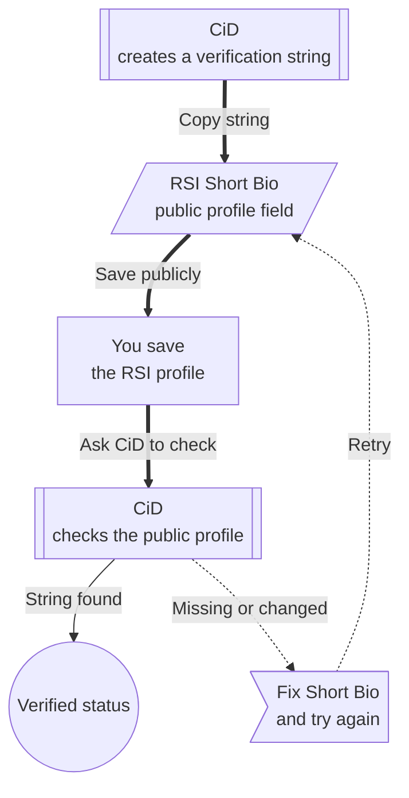

# RSI Verification

RSI verification connects your Citizen iD account to your Star Citizen identity.
It proves that you control a specific RSI account by asking you to place a Citizen iD verification string in a public RSI profile field.
Communities can then rely on Citizen iD verified status instead of asking every player to repeat manual screenshot checks.
Verification is useful for Discord roles, external application claims, community access rules, and player profile context.

It is still only a Star Citizen account-control check.
It is <em>not</em> real-world identity verification, age verification, reputation scoring, payment verification, or proof that a player is trustworthy.

**Diagram: RSI verification at a glance.**
CiD gives you a temporary string, you place it on your public RSI profile, and CiD checks that public profile before marking the account verified.

<figure class="cid-illustration">
  <figcaption><strong>Illustration plan:</strong> RSI verification three-step screenshot sequence.</figcaption>
  
The page should show three screenshots side by side: the RSI account dashboard where the username is found, the RSI profile settings page with the Short Bio field highlighted, and the Citizen iD success state after verification.

  
A short video variant could show copying the verification string, opening RSI profile settings, saving the short bio, and returning to Citizen iD.

</figure>

## Before Starting

Use only an RSI account that you own or control.
Citizen iD expects one Citizen iD account to be linked with one RSI account.
This rule protects communities from duplicate verification, impersonation, and ban-evasion patterns.

Before you begin, check these boundaries:

- Do not try to verify an account owned by another person, even if that person gave you temporary access.
- Do not verify a shared organization account unless Citizen iD explicitly supports that use case in the future.
- Do not create a second Citizen iD account to work around a verification problem.

::: warning One RSI account
RSI verification is intentionally more sensitive than ordinary provider linking.
Unlinking or changing a verified RSI account may require support or operator review because the link is part of the trust model.
:::

## Verification Steps

Follow the verification flow in order.
Skipping steps or editing the token usually causes the check to fail.

1. Open the RSI account dashboard.
2. Find your RSI username near your avatar.
3. Copy the username after the `@` symbol.
4. Enter that username into Citizen iD.
5. Wait while Citizen iD checks whether the RSI profile exists and whether it is already linked to another Citizen iD account.
6. Copy the verification string generated by Citizen iD.
7. Open RSI profile settings.
8. Find the <strong>Short Bio</strong> field.
9. Paste the verification string exactly.
10. Save the RSI profile.
11. Return to Citizen iD and click the verification button.
12. Wait for Citizen iD to read the public RSI profile.
13. Remove the temporary string from your RSI profile only after Citizen iD confirms success.

## Failed Checks

Verification can fail for ordinary reasons.
Common causes include:

- The username is misspelled.
- The RSI profile is temporarily unavailable.
- The profile is already linked to another Citizen iD account.
- The verification string is missing.
- The verification string was changed, wrapped in extra text, or placed in the wrong field.
- The RSI profile was not saved publicly yet.

If verification fails:

1. Return to the profile settings step.
2. Compare the verification string exactly.
3. Remove punctuation, spaces, Markdown, or extra text that was added around the string.
4. Confirm that the string is still in the Short Bio field.
5. Wait briefly if RSI needs time to update the public profile.
6. Try verification again after the public profile is updated.

## Verified Status

Verified status tells Citizen iD and approved integrations that your account has passed the RSI account-control check.
A community can use verified status for several kinds of access decisions:

- Granting Discord roles.
- Allowing external application access.
- Displaying verified profile context.
- Requiring verified claims in a community tool.

Some Citizen iD features can be used without verified status.
Other features can be blocked until verification is complete because the community or application requires RSI-backed identity.

## Skip Option

Some flows let you skip verification and continue.
The skip option means:

- You can continue when verification is not required for the action you are doing right now.
- You do not receive verified status.
- A Discord role, community rule, or external application can still block access until verification is complete.

## Refresh Behavior

After verification, Citizen iD can refresh public RSI profile data when needed.
This matters if your RSI handle, display data, or public organization data changes.

Refresh behavior does not mean Citizen iD controls RSI.
It means Citizen iD can re-read supported public RSI/Spectrum data and update the Citizen iD account state or claims that depend on it.

::: details Details for support and account changes

Contact support if you verified the wrong RSI account, cannot verify because the profile is already linked, need a verified RSI link reviewed, or believe RSI profile data is stale after a refresh.

Include:

- The RSI username you entered.
- The approximate UTC time of the attempt.
- The exact error message.
- Whether you recently changed RSI profile data.

Do not post private RSI account pages or account credentials in public support channels.

:::
