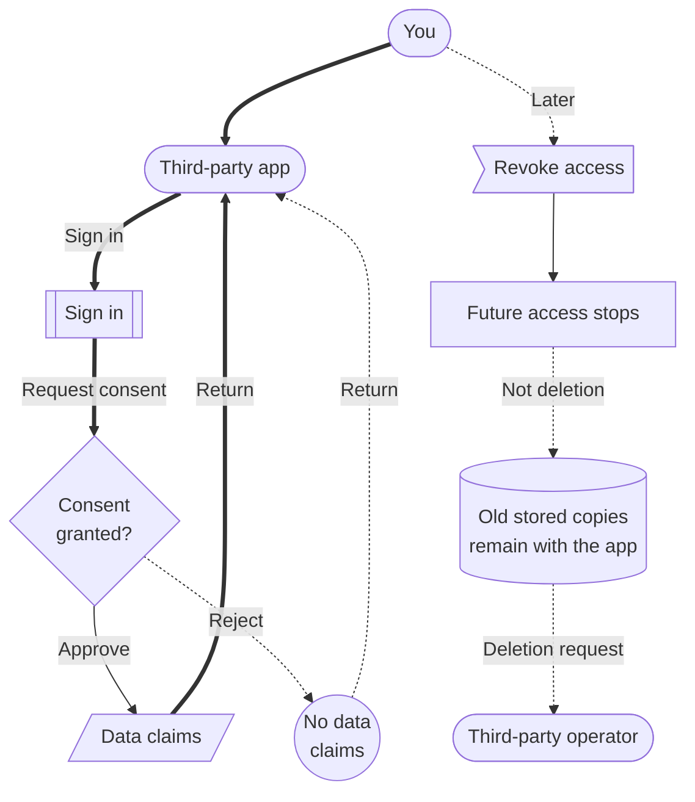

# Third-Party Apps

Third-party apps are applications operated outside Citizen iD that use Citizen iD for sign-in, account linking, or API access.
A third-party app can be any web, desktop, or mobile application.

Citizen iD is the identity provider in these flows.
The third-party application is still operated by its own community or developer.

That distinction matters because Citizen iD can control what it sends going forward, but it does not control every database where an application stores data after receiving it.

Some applications show a community name with a relationship icon next to it.
Hover over or focus that icon to inspect what relationship the community has with Citizen iD.
Some relationships may communicate a higher level of trust between Citizen iD and the corresponding application or developer, but the icon does not replace consent review.

<ImageFigure
  src="/images/sign-in-with-cid-example.png"
  alt="Example community application screen with a Sign in with Citizen iD button."
  title="Sign in button"
  caption="Shows how a community application may start a Citizen iD sign-in flow."
  description="After selecting this kind of button, the application sends you to Citizen iD so you can sign in and review any required consent."
  note="This image is a placeholder from an older community-tool sign-in surface and should be replaced with a current demo application when available."
  missing="The ideal image should show a current third-party app start screen, the app or community name, the Citizen iD sign-in button, and any visible community relationship indicator."
/>

**Diagram: App sign-in and consent.**
The important player choice happens at the consent screen before Citizen iD sends approved information back to the application.

Read the approval and rejection branches as the decision point in the consent screen.
Approval lets Citizen iD send only the approved facts back to the app, while rejection ends the request without granting access.
The later revocation branch explains a different action: it stops future Citizen iD access, but it does not erase copies an app already stored.

## Sign In Flow

When an application needs Citizen iD identity, it redirects you to Citizen iD.
The normal sign-in flow is:

1. The third-party application redirects you to Citizen iD.
2. Citizen iD signs you in or uses your existing session.
3. Citizen iD shows a consent screen when you need to make a decision.
4. You approve or reject the request.
5. Citizen iD sends you back to the application with the result.

The first time an application asks for access, Citizen iD always asks for your explicit consent.
After that, Citizen iD may skip showing the same consent screen if the application asks for the same access and you have not revoked it.
If the application asks for new access later, you should expect to review consent again.

If something required is missing, such as an email address, linked Discord account, or verified RSI profile, Citizen iD can stop the flow and tell you what needs attention first.
Citizen iD tries not to create a new account by accident during a third-party app sign-in.
Some flows can still support deliberate creation of a completely new Citizen iD account, but that should be treated as account setup rather than ordinary returning-user sign-in.

## Consent Screen

The consent screen is where you decide whether a specific application may receive selected information from Citizen iD.
Before approving, review:

- The application name.
- The community or operator you expect to be using.
- The community relationship icon, if one appears next to the community name.
- What information the application wants.
- Whether the application is asking for continuing access.
- Whether the application explains why it needs the requested access.

If a request does not make sense for what you are trying to do, stop and ask the application operator why it is needed.
Approving consent should be an informed choice, not a reflexive button click.

::: warning Broad access requests
Be suspicious of applications that ask for broad access without explaining why.
Most applications should not need your account email address.
Treat email access as sensitive and approve it only when the application gives a clear reason.
:::

::: tip Community relationship icons
Community relationship icons are context for the application and community you are dealing with.
They may indicate a closer or more trusted relationship with Citizen iD, but they do not automatically mean that every requested permission is necessary.
:::

## Shared Information

Applications ask for permissions.
The technical word for a permission category is a scope.
After you approve access, Citizen iD may send individual pieces of information to the app.
Those pieces of information are sometimes called claims.

Shared information might include:

- Your Citizen iD account.
- Your preferred username.
- Your display name.
- Your email.
- Your Citizen iD roles.
  - Global roles (verification/staff status)
  - Custom community-scoped roles.
- Your RSI username.
- Your RSI organization membership.
- Other approved facts.

Not every permission always sends information.
Some information is optional, so Citizen iD can simply leave it out when your account does not have it.
Other information is required by the application.
You cannot consent to required information that your account does not have.

For example, an app may require a verified RSI profile, a linked Discord account, or an email address.
If your account is missing the required item, Citizen iD can block the consent flow until you add it.

::: warning Required account data
If Citizen iD says required account data is missing, fix that account item first.
Reject the request if the application has not explained why it needs that information.
:::

## Revoke Access

Use revocation when you no longer want an application to keep receiving information through Citizen iD.

1. Open the authorized apps area of your Citizen iD account.
2. Review the applications connected to your account.
3. Open the application's details.
4. Check what access it currently has.
5. Look for more than one saved entry from the same application.
6. Use <strong>Revoke Authorization</strong> for every entry that should stop.
7. Sign in again later only if you intentionally want the application to use Citizen iD again.

One application can have more than one saved access entry if it asked for different access over time.
To fully stop future Citizen iD access for that application, revoke all saved entries for that application.

<ImageFigure
  src="/images/citizenid-account-overview-current.png"
  alt="Current Citizen iD account overview showing an applications row with an authorized application count and manage action."
  title="Authorized applications"
  caption="Shows where a player can start reviewing applications that currently have Citizen iD access."
  description="Use the applications area to inspect connected apps, review approved access, and revoke access you no longer want."
  missing="The ideal image should show the current authorized-app detail page, including app identity, community relationship indicator, approved access, more than one saved entry when present, and the revoke action."
/>

## Retained Data

Revocation stops future access through Citizen iD.
It does not automatically delete data the application already received while authorized.

::: danger Third-party retained data
Third-party retained data is fully outside Citizen iD control.
Citizen iD cannot delete, export, correct, or guarantee removal of copies stored by a third-party application.
Request deletion from the corresponding application operator or developer.
:::

If the application stored a copy of your profile, roles, RSI data, or email while access was valid, contact the application or community operator for deletion, correction, or export requests about that copy.
This is the same practical boundary that exists with many sign-in providers: revoking future access does not reach into every third-party system and erase historical records by itself.

## Safer Habits

Use these habits for third-party apps:

- Approve only applications you recognize.
- Prefer the minimum access needed for the task.
- Hover over or focus community relationship icons before relying on them.
- Review authorized apps periodically.
- Revoke old saved entries when you stop using an application.
- Revoke every saved entry for the same application when you want access fully stopped.
- Be suspicious of applications that ask for broad access without explaining why.
- Treat email access as unusual unless the application clearly needs it.

::: details Details for debugging app sign-in

When a third-party application sign-in fails, record:

- The application name.
- The community name and relationship icon text, if visible.
- The environment, if you know it.
- The requested action.
- The requested access or missing account data mentioned on the consent screen.
- The approximate UTC time.
- The non-secret error message.

If a consent screen says data is missing, fix the missing Citizen iD account state first, such as adding email, linking Discord, or completing RSI verification.

Do not share access tokens, authorization codes, refresh tokens, client secrets, or full callback URLs in public.

:::
